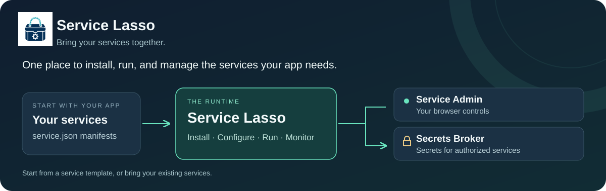

# Service Lasso



[](https://github.com/service-lasso/service-lasso/actions/workflows/docs-site.yml?query=branch%3Adevelop) [](https://nodejs.org/) [](LICENSE)

**Run the services your app needs. Manage them in one place.**

Service Lasso installs, configures, starts, and monitors local services for you. Give it a service manifest; it handles downloads, dependencies, and startup order, with a browser UI to see what's running.

Use it to bring up a local app stack or ship supporting services with a Node, web, or desktop app. Manage native service processes through the UI, CLI, or HTTP API.

## Try it

You need **Node.js 22+**, **npm**, **Git**, and internet access to download service releases. The first start takes longer while those downloads complete.

```sh
git clone --branch develop https://github.com/service-lasso/service-lasso.git
cd service-lasso
npm ci
npm run demo
```

Open **[Service Admin](http://127.0.0.1:17700/)**. If first-run setup appears, complete it and save the recovery information it provides. [First-run help →](docs/quick-start.md)

Once setup is complete and services are running, open the [Echo demo](http://127.0.0.1:4010/). Find `echo-service` in Service Admin to inspect its status and logs, then try stopping and starting it.

To stop the demo, run this from the same folder in another terminal:

```sh
npm run demo:stop
```

[How Service Lasso, Secrets Broker, and templates fit together →](docs/understand-service-lasso.md)

## Make it yours

**[Add PostgreSQL and connect an app →](docs/first-useful-service.md)** · [Let your agent do it →](docs/agent-prompts.md)

- **Bring your services.** Describe how to install and run each one in a `service.json` manifest. [Write a service →](docs/service-authoring/overview.md)
- **Choose ready-made services.** Browse databases, runtimes, proxies, and other services you can add to your app. [Service catalog →](docs/service-catalog.md)
- **Embed the runtime.** Use the npm package or start from a Node, web, Electron, or Tauri reference app. [CLI, API, and npm →](docs/runtime/README.md) · [App templates →](docs/reference-apps.md)

[Demo commands, ports, and troubleshooting →](docs/demo/README.md)

## Go further

| When you need to… | Read |
| --- | --- |
| Run services, check health, logs, recovery, or backups | [Run and manage services](docs/operations/README.md) |
| Create a release-backed service | [Build a service](docs/service-authoring/overview.md) |
| Add Lasso to an application | [Use Service Lasso in your app](docs/integration/README.md) |
| Look up stable contracts | [Technical reference](docs/reference/README.md) |
| Set up access and secret boundaries | [Security and access](docs/security/README.md) |
| Build, test, or contribute | [Contribute and maintain](docs/contributing/README.md) |

Secrets support and validation status: [capability ledger](docs/reference/secrets-capability-ledger.md). Report vulnerabilities privately using [Security Advisories](SECURITY.md).

Apache-2.0 · [License](LICENSE)
