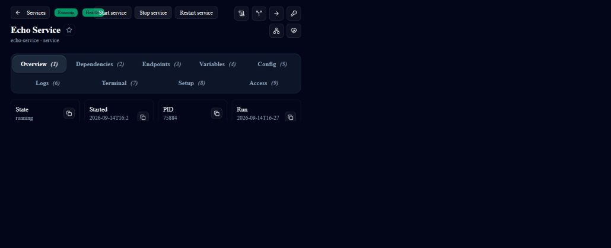

# Newcomer journey verification

Observed on Windows, Node.js 22.23.2, 15 September 2026 (Australia/Sydney). This is an existing development machine with fresh, isolated service workspaces, not a clean-machine or cross-platform benchmark.

| Journey | Evidence |
| --- | --- |
| Open Admin | Released Admin `2026.8.31-f015b44`, Core source base `1c265524029f86766947775f9f46799f82bd465c`; visible first-run, login, Services and Echo detail screens |
| Stop/start Echo | Detail-page Stop presents confirmation; observed Stopped, then Running/Healthy after Start; table-row Stop fails confirmation and is tracked in Admin #619 |
| Add PostgreSQL | Released PostgreSQL `2026.5.3-ddd9e47`, Windows artifact; npm runtime `2026.9.13-1bffd1b`, pg `8.23.0`; real write/read and app HTTP check pass |
| Source package | npm archive inspected; only nine app/metadata files, no workspace or database; fresh unpack/install/setup/start succeeded on the same Windows machine |
| Dependency failure | Stop PostgreSQL through its confirmed lifecycle API; app returns 503; start PostgreSQL and repeat database write/read plus app check successfully |
| Configuration | Set the example's `POSTGRES_MAX_CONNECTIONS` to `120`, restart, and verify `SHOW max_connections` reports `120` alongside the passing app check |
| MCP | SDK client connects, lists 15 read-only tools, calls runtime status and service list without tool errors |
| Central docs | Site build passes; 15 existing demo documentation/lifecycle tests pass; 21 packaged Help Center articles have deterministic export and checksum verification |

The fresh unpacked example reported **13.0 seconds from runtime launch to app readiness**, excluding npm installation and service download. A later restart reported **7.4 seconds**. These are observations, not first-run speed promises.

## Limits found by exercising the journeys

- The pinned PostgreSQL launcher uses a nonempty initialization directory and detaches its database through `pg_ctl`. The example supplies a small foreground launcher and a separate initialization directory; it does not claim the unmodified old launcher is reliable.
- The canonical demo verifier failed on the deliberately noncanonical isolated ports and an MCP rate-limit response. Later direct MCP discovery and reads passed. The canonical gate is not reported as passing.
- Admin develop `a61dc047b8f8e8038b30f6205a2972ee22517468` fails lint/build after its dependency update: TypeScript 7 is unsupported by its linter, and TanStack Table 9 changes break existing tables. Tracked in [Admin #618](https://github.com/service-lasso/lasso-serviceadmin/issues/618). Packaged-help checks passing do not imply an Admin build passed.
- No clean-machine, Linux, macOS, or offline bundled acceptance is claimed. The source package requires internet access and Node.js.
- Some ecosystem repositories still lack an authorized `develop` source. Their migrations remain in the [repository audit](../components/documentation-migration.md).

## Remaining acceptance ownership

The observations above remain historical. As reconciled on 15 September 2026:

| Remaining outcome | Owning issue | Completion evidence |
| --- | --- | --- |
| Clean-machine Windows, Linux and macOS journeys | [Core #1280](https://github.com/service-lasso/service-lasso/issues/1280) | Exact artifact identities, real app write/read and dependency recovery, package startup and owned cleanup on each platform |
| Complete operator screen and state captures | [Core #1281](https://github.com/service-lasso/service-lasso/issues/1281) | Every required capture-manifest entry has readable, secret-free direct evidence |
| Admin packaged-help adoption | [Admin #617](https://github.com/service-lasso/lasso-serviceadmin/issues/617) | Merged component delivery, offline loading and source-drift verification |
| Services table confirmation | [Admin #619](https://github.com/service-lasso/lasso-serviceadmin/issues/619) | Confirm, cancel and denied paths plus resulting service-state verification |

The earlier `9fad18649b8640d98aaa91b6a8153c6b5065b59f` Windows real-Broker failure is historical branch evidence. [Admin PR #620](https://github.com/service-lasso/lasso-serviceadmin/pull/620) subsequently merged as `abd681ed1c76f6e57b23d4baabf61e4a4e3f384d`; its repaired qualification evidence reached the all-passing source head `b2de81f0d6310b1f3c1387a78f81ec9e3d9c5973`. That is source qualification evidence, not a released rollout or completion of the remaining outcomes. The referenced Core #1273 is now closed; released rollout and remaining journey evidence are still unverified. [Core #1270](https://github.com/service-lasso/service-lasso/issues/1270) stays open until the linked outcomes are verified.

## Portable browser-proof receipt

For Service Lasso newcomer qualification, create a new owned evidence folder;
that folder is the accepted new-machine equivalent. Run:

```sh
npm run verify:newcomer-proof -- --issue=<GitHub issue number>
```

The command allocates an owned port range, services root, workspace root,
browser session, and receipt directory. The current implementation exercises
first-run acknowledgement and persistence, credential re-read denial, Echo
cancel/stop/start/restart with authoritative process and refresh checks, and the
existing ops route audit/redacted-capture toolset. These remain partial coverage,
not the complete newcomer journey. App failure/recovery,
source-package and concurrent-instance coverage remains required before newcomer
acceptance; the receipt lists those outstanding scenarios explicitly. The command writes a ZIP under
`newcomer-proof-artifacts/`. It retains the ZIP
and stops only the owned runtime. Private runtime state is retained locally for
diagnosis, outside the upload bundle. Cleanup is Verified only when both the
lifecycle stop succeeds and durable process ownership has settled.

Raw Playwright reports are retained outside the ZIP in `private-playwright`;
they may contain first-run credentials. Never upload that directory or
`private-playwright-command.json`, any `private-*.json` diagnostics, or the
runtime folder. The browser receipt records the actual installed Playwright and
Chromium versions and UTC execution times. Review the ZIP's approved screenshots before
uploading. A passing implemented subset remains `Blocked` while required
scenario coverage is outstanding.

To qualify concurrent isolation, run two invocations from distinct new folders
at the same time and attach both ZIPs to the platform issue. The issue comment
must state only the exact candidate identity, OS and Node versions, command,
UTC start/end, proof IDs, ZIP names/checksums, scenario classifications, and
owned-cleanup result. Do not attach credentials, tokens, passwords, raw
configuration, private paths, or unredacted logs. A failed receipt is
`Invalidated` or `Blocked`; it is never substituted with CI or edited evidence.

## Visible product capture



Captured from `/services/echo-service` on the isolated Admin at port 18401 after stop/start. Cropped to the service controls and state; no credentials or secret values. This replaces a blank-page claim with a visible observation, not a claim that the complete screenshot inventory is finished.
