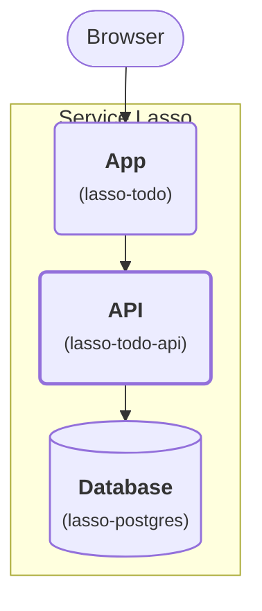

# Advanced — Add a Go Todo API service

Continue the managed [Todo](beginner-todo-app.md) and
[PostgreSQL](intermediate-make-todo-app-durable.md) lessons. Add a Go API as the
third application service in the same Service Lasso inventory. Keep the Todo UI
service, move database access into the API and learn dependency chains and
managed API recovery.

## Outcome

**Stage 3: Add the API.** The App calls the API, which reads and writes the Database.

<div className="tutorial-architecture">



</div>

The highlighted service is new in this lesson. Everything inside the boundary is managed by Service Lasso.

| Purpose | Service | Responsibility / data path |
| --- | --- | --- |
| App | `lasso-todo` (`todo`) | Serve the browser UI and proxy `/todos` to the API's allocated HTTP endpoint. |
| API | `lasso-todo-api` (`todo-api`) | Validate requests and read/write SQL through the Database's allocated endpoint. |
| Database | `lasso-postgres` (`postgres`) | Retain todos in `${SERVICE_ROOT}/data/database` across service restarts. |

<details>
<summary>Existing platform services</summary>

These services also run inside Service Lasso. They support the application path shown above.

| Purpose | Service | Responsibility |
| --- | --- | --- |
| Management | `lasso-serviceadmin` (`@serviceadmin`) | Install, configure, start and stop services; show health and endpoints. |
| Secrets | `lasso-secretsbroker` (`@secretsbroker`) | Provide the platform's managed secret delivery. |
| Example | `echo-service` | The starter service already included in the demo. |
| Runtime | `lasso-node` (`@node`) | Run the App's packaged JavaScript. |

</details>


## 1. Inspect and package another template-derived service

Use Go1.22+ and Node22+. In your Core checkout terminal:

```powershell
git clone --branch develop --single-branch https://github.com/service-lasso/lasso-todo-api.git ../lasso-todo-api
gh api repos/service-lasso/lasso-todo-api --jq '.template_repository.full_name'
npm --prefix ../lasso-todo-api ci
npm --prefix ../lasso-todo-api test
npm --prefix ../lasso-todo-api run package
npm --prefix ../lasso-todo-api run verify
```

The query must print <code>service-lasso/service-template</code>. This separate service repository owns real Go source, manifest, packaging, verification and CI. Its template package/test/verify entrypoints are adapted for Go.

| Manifest field | What this service adds |
| --- | --- |
| id: todo-api | A separately managed API |
| artifact.platforms | Native archive and command matching the packaged binary |
| depend_on: postgres | Start the database before its consumer |
| endpoints.web | An allocated loopback HTTP API |
| env | API port and actual PostgreSQL runtime allocation |
| healthchecks | HTTP readiness includes a real database ping |

[Go source](https://github.com/service-lasso/lasso-todo-api/blob/develop/src/main.go) implements health, create/list and parameterized SQL using the same <code>tutorial_todos</code> table as stage two. The API limits titles to 200 bytes; a long non-ASCII title can therefore receive an API validation error even when the UI's character check accepts it.

Local verification checks native archive structure. Real SQL verification uses <code>TODO_VERIFY_DATABASE_STATE</code>; CI separately executes the held Linux archive against PostgreSQL. Compilation does not qualify runtime behavior on other platforms.

## 2. Import the API and switch Todo to its proxy

Stop Todo in Admin, preserving data. From Core:

```powershell
node dist/cli.js services import service-lasso/lasso-todo-api --tag 2026.10.4-9b45f09 --services-root workspace/canonical-services-root --workspace-root workspace/demo-instance
node ../lasso-todo/scripts/configure-stage.mjs workspace/canonical-services-root/todo api
```

Refresh Admin. Install/Configure the API, then start PostgreSQL, API and Todo in dependency order, waiting for healthy. Lasso acquires the pinned checksum-verified native binary and supplies ports, environment, ownership and health. Todo reads the API's runtime allocation when it starts. Do not launch the Go binary manually.

```text
Todo → Go Todo API → PostgreSQL
```

Inspect dependencies, acquired release/checksum, processes, logs and Network views. The browser receives no database credentials. Open Todo's resolved UI URL.

## 3. Verify the request path and recovery

1. Confirm todos from stages one and two remain.
2. Add another todo through the browser and refresh.
3. Find <code>Created todo through Go API</code> in API logs to prove the proxy path.
4. Stop only the API through Admin, confirming the action. Create/list must fail; inspect dependency health. A running proxy returns503 while the API is down.
5. Start the API, then Todo if needed, and confirm recovery with all saved IDs.
6. Stop Todo, API and PostgreSQL through Admin; restart in dependency order and confirm the complete set again.

**Pass:** three managed services recover without losing data and actual requests reach the acquired Go API. A separately launched binary is not a pass.

## What the template workflow gave you

Both application services own their GitHub template provenance, source, manifests, platform packages, tests, verification and explicit candidate publication. Consumer manifests pin real development prereleases. Source builds, acquired bytes, runtime evidence, docs publication and GA are separate claims. Follow [validate and release](../service-authoring/05-validate-release.md) when authoring your own service.

Stop services through Admin and keep data. Whole-demo shutdown/recycle remains unqualified [#1665](https://github.com/service-lasso/service-lasso/issues/1665). Next: [ZITADEL SSO Hub](zitadel-sso-hub.md), [wire consumers](../service-authoring/04-wire-consumers.md), or [package your app](../package-your-app.md).
