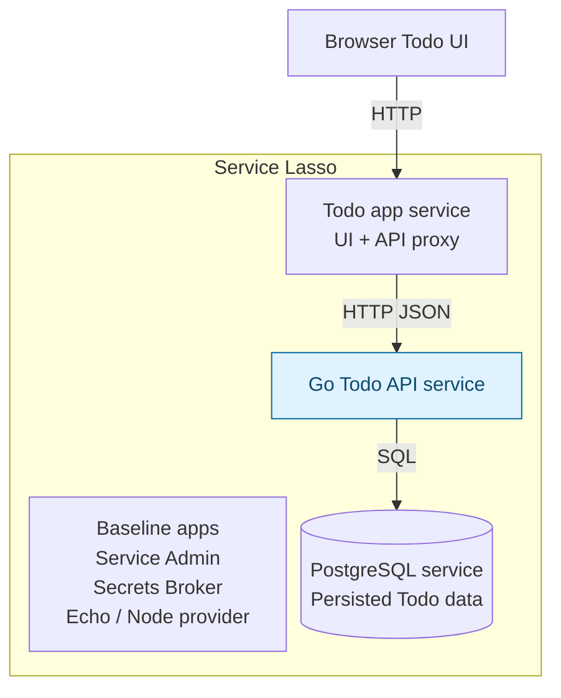

# Advanced — Add a Go Todo API service

Continue the managed [Todo](beginner-todo-app.md) and
[PostgreSQL](intermediate-make-todo-app-durable.md) lessons. Add a Go API as the
third application service in the same Service Lasso inventory. Keep the Todo UI
service, move database access into the API and learn dependency chains and
managed API recovery.

## Outcome

**Stage 3: Add a managed Go API.** The Todo app runs inside Service Lasso from
the first lesson. Every application process shown inside the boundary is managed
by Lasso; the browser connects to the Todo service's allocated web endpoint.



Blue highlights what this lesson adds. Solid arrows show application traffic.
Service Admin operates the services in the boundary; Lasso installs, starts,
stops, allocates ports and monitors their health. The JSON file in stage 1 is
Todo service data, not another service. Other runtime support packages are omitted.

The browser uses the Todo service on the same origin. That service proxies
`/todos` to the Go API's allocated HTTP endpoint; only the Go API talks SQL.

## 1. Build and add the Go service

Install Go 1.22 or newer and confirm `go version` works. The first build needs
internet access to download the pinned PostgreSQL driver. From the same checkout:

```sh
npm run demo:stop
# Wait for this demo to report stopped and its process to exit.
node examples/getting-started-todo/add-stage.mjs api
```

The helper builds the checked-in Go source, writes `workspace/canonical-services-root/todo-api/service.json`
and changes Todo's dependency to `[@node, todo-api]`. The new API depends on
`postgres`. Its environment receives the allocated web port and the database's
runtime allocation path. Todo reads the API allocation on startup. No database
credentials are sent to browser code.

Inspect the new manifest:

| Field | What this lesson adds |
| --- | --- |
| `id: todo-api` | A separately operated API service |
| `executable` | Your compiled Go binary in the service payload |
| `depend_on: [postgres]` | Start the database before its consumer |
| `endpoints.web` | A loopback HTTP API endpoint with an allocated port |
| `env` | Supply that port and PostgreSQL runtime allocation |
| `healthchecks` | `/healthz` checks the API and a real database ping |

The [Go source](https://github.com/service-lasso/service-lasso/blob/develop/examples/getting-started-todo-api/main.go)
implements `GET /healthz`, `GET /todos` and `POST /todos` using the same
`tutorial_todos` table as stage 2. It uses parameterized SQL and binds to loopback.
The helper refuses to overwrite an existing `todo-api` payload.

## 2. Start the dependency chain

```sh
npm run demo
```

In Admin, confirm the inventory contains **Todo App**, **Go Todo API** and
**PostgreSQL**. Inspect the dependency chain:

```text
Todo App → Go Todo API → PostgreSQL
```

Start PostgreSQL, then API, then Todo if they did not autostart. Wait for healthy,
inspect each process and Network endpoint, then open the Todo UI from Admin.
Do not start the Go binary by hand; Lasso must own its lifecycle.

## 3. Verify the API path and recovery

1. Confirm stage 1/2 todos are still visible.
2. Create another unique todo in the UI and refresh.
3. In Go API logs, find `Created todo through Go API` to verify the request path.
4. Stop only `todo-api` in Admin and confirm create/list is unavailable and Todo's
   dependency health reflects the failure. If Lasso stops dependents, that is
   expected; inspect their states rather than assuming the UI stays running.
5. Start the API, wait for healthy, then start Todo if needed. Reopen Todo's
   allocated URL and confirm all saved todos remain.
6. Stop Todo, API and PostgreSQL; restart in dependency order and repeat.

**Pass:** the three managed services recover through Admin without losing data,
and Todo requests reach the Go API. A manually launched API is not a pass.

## 4. From local service to a released package

This tutorial builds a local service payload for your development machine. Once
it works, use [service-template](https://github.com/service-lasso/service-template)
to publish Go binary artifacts for your target platforms, pin the release in
`workspace/canonical-services-root/todo-api/service.json`, and follow [Validate and release](../service-authoring/05-validate-release.md).
A local build is not a release artifact or platform qualification.

## Stop and next

Use Admin to stop Todo, API and PostgreSQL, or stop your demo with
`npm run demo:stop`. Keep their data and service folders.

Next: [ZITADEL SSO Hub](zitadel-sso-hub.md), [wire consumers](../service-authoring/04-wire-consumers.md),
or [package your app](../package-your-app.md).
