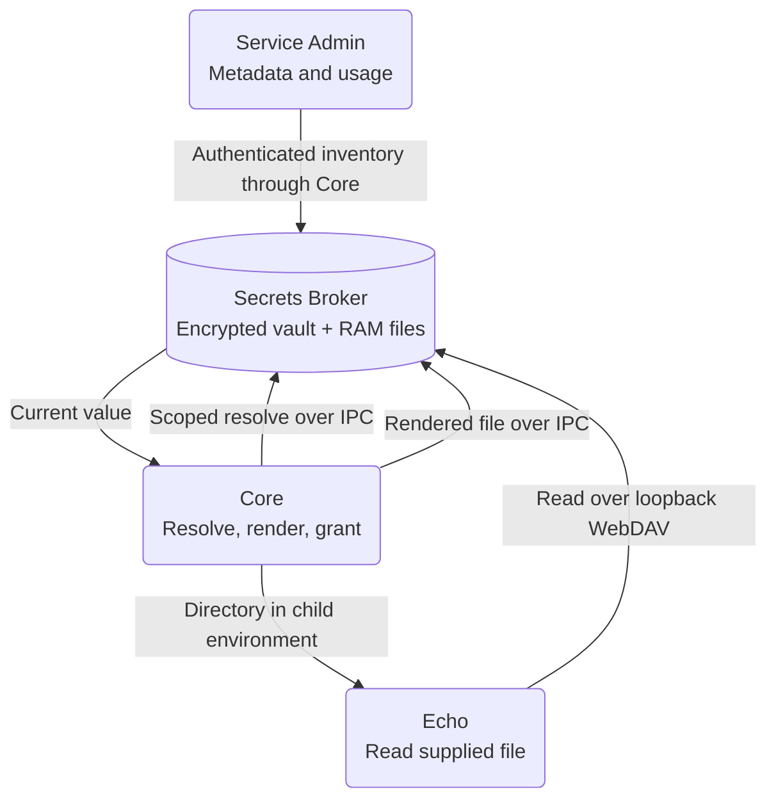

# Advanced - Provision Service Secrets Securely

**Lesson code:** [Echo RAM WebDAV sample](https://github.com/service-lasso/lasso-echoservice/tree/develop/examples/webdav).
The sample manifest and [consumer guide](https://github.com/service-lasso/lasso-echoservice/blob/develop/docs/webdav-example.md)
show a managed service reading a Broker-backed JSON file without printing its
value. Continue from a working [Service Admin and Echo workspace](../quick-start.md).
This optional advanced lesson can also follow the Todo lessons; it uses Echo
to make file consumption visible without changing your Todo data.

## Outcome

Declare a scoped secret import, ask for an ephemeral file, and let Core supply
its location to the service. Read it through Broker's local RAM WebDAV listener,
then use Admin to see its size and completed downloads. Stop/start the service
and verify the file is recreated under a fresh grant.



| Purpose | Component | Responsibility |
| --- | --- | --- |
| Orchestration | Core | Resolve declared imports, render ephemeral outputs before launch, pass their directory, revoke the grant on stop. |
| Secrets | Secrets Broker | Retain the encrypted vault and serve temporary output bytes from bounded RAM under a scoped capability. |
| Consumer | `echo-webdav` | Read the supplied JSON and expose safe read status. |
| Management | Service Admin | Show listener state, RAM usage, file ownership, sizes, download counts and last access. |

## Before you start

Use a separate learning service folder and a Broker that is initialized,
unlocked and available to Core. Your operator needs permission to create the
demo secret and workspace-read permission to inspect inventory.

Use matching builds containing Core's RAM file-grant support, Broker's
`/v1/file-grants` and `/v1/file-grants/status` APIs, Admin's **Secrets Broker →
RAM files** page, and Echo's `/secret-file` consumer. These features landed in
[Core #1739](https://github.com/service-lasso/service-lasso/pull/1739),
[Broker #200](https://github.com/service-lasso/lasso-secretsbroker/pull/200),
[Admin #692](https://github.com/service-lasso/lasso-serviceadmin/pull/692) and
[Echo #13](https://github.com/service-lasso/lasso-echoservice/pull/13).
Publishing this lesson does not upgrade existing installed packages.

The source sample uses `go run .`: install the Go version required by Echo's
`go.mod`. Packaged consumers retain their packaged executable and arguments.
Native integration for this sample was checked on Ubuntu, with separate
Windows IPC/UNC checks; this is not a qualification of every platform or account.

## 1. Put the demo value in Broker

In Service Admin, open Secrets Broker's secret management view and create:

| Field | Demo value |
| --- | --- |
| Namespace | `shared/echo` |
| Ref | `echo.DEMO_CREDENTIAL` |
| Value | `synthetic-demo-credential` |

The full stored reference is `shared/echo/echo.DEMO_CREDENTIAL`. Use this
synthetic value for the lesson. Real credentials belong in Broker, not in a
checked-in service manifest or template source.

## 2. Ask for file delivery in the service manifest

The [sample service.json](https://github.com/service-lasso/lasso-echoservice/blob/develop/examples/webdav/service.json)
contains the following additions to a normal Echo manifest:

```json
{
  "broker": {
    "imports": [
      {
        "namespace": "shared/echo",
        "ref": "echo.DEMO_CREDENTIAL",
        "required": true
      }
    ]
  },
  "config": {
    "files": [
      {
        "path": "demo-config.json",
        "content": "{\"demoCredential\":\"${echo.DEMO_CREDENTIAL}\"}",
        "ephemeral": true
      }
    ]
  },
  "env": {
    "ECHO_SECRET_FILES_DIR": "${SERVICE_LASSO_SECRETS_DIR}",
    "ECHO_SECRET_FILE_NAME": "demo-config.json"
  }
}
```

This is a fragment, not a complete runnable manifest. Keep the sample's
executable, endpoints and other service fields. For source use, place its full
manifest beside Echo's `main.go` as `service.json` in a separate service folder
under your host's services root, and refresh service discovery. It appears as
`echo-webdav`. For an existing packaged Echo, stop it before editing and merge
the import, file and environment entries while retaining its executable/args.

Prepare a new source folder from a terminal outside your host's services root:

```powershell
git clone --branch develop --single-branch https://github.com/service-lasso/lasso-echoservice.git echo-webdav
Copy-Item echo-webdav/examples/webdav/service.json echo-webdav/service.json
```

Move that new `echo-webdav` folder into your learning host's actual services
root before refreshing discovery. Preserve any existing service folder; do not
replace a retained Echo instance with this sample.

| Declaration | What it requests |
| --- | --- |
| `broker.imports` | Resolve a permitted value in a specific namespace. An import alone does not create a file. |
| `config.files[].ephemeral: true` | Render the inline content into the secret-file provider before fresh launch. Ordinary files without this flag remain ordinary configuration. |
| `config.templates[].ephemeral: true` | Render a secret-free packaged template into the provider instead; declare every Broker ref its content uses. |
| `${SERVICE_LASSO_SECRETS_DIR}` in `env` | Pass Core's launch-specific directory to an environment variable the app actually supports. |

For a single-value file, set `content` to just the selector and pass
`${SERVICE_LASSO_SECRETS_DIR}/password` to an app-supported variable such as
`DB_PASSWORD_FILE`. `_FILE` names are conventions: Core does not infer them or
convert arbitrary environment secrets into files. Environment-only secret
delivery remains available through an explicit selector in `env`.

Core performs text substitution, not JSON encoding. The lesson's synthetic
value is JSON-safe. For real structured credentials, provide appropriately
encoded content; do not assume quotes or newlines in a secret are escaped.

## 3. Start the service through Core

Use Admin's Install/Configure actions when offered, then Start `echo-webdav`.
Do not launch Echo directly: that would bypass the managed secret-file preparation.

On a fresh launch, Core:

1. Resolves the service's current scoped Broker imports. A missing or denied
   required value prevents process spawn.
2. Renders the declared ephemeral files/templates in memory.
3. Sends the rendered outputs to Broker over authenticated local IPC with a
   service/workspace/peer-bound launch lease. Broker creates a fresh RAM grant.
4. Supplies its private directory through the declared child environment and
   starts the app. Neither file bytes nor capability tokens become durable
   lifecycle/configuration snapshots.

The service gets a Windows UNC directory or a Linux/macOS HTTP directory.
Echo converts the Windows directory to a loopback HTTP request, so this sample
needs no mapped drive or Windows WebClient setup. Other apps must support their
supplied URL or native UNC path; a Linux HTTP URL is not a POSIX file path.
Apps that require a native Linux file path can explicitly use the
[tmpfs alternative](../reference/linux-app-secret-files.md).

## 4. Prove the app read the file

Open Echo's allocated service HTTP endpoint from its Network view. Use that
actual endpoint rather than assuming port 4010. In PowerShell:

```powershell
$echoUrl = 'http://127.0.0.1:4010' # Replace with Echo's allocated service endpoint.
Invoke-RestMethod "$echoUrl/secret-file"
Invoke-RestMethod -Method Post "$echoUrl/secret-file"
```

GET reports only `status`, `sizeBytes`, `reads` and `lastReadAt`; it does not
reread the secret. Expect `ready` and at least one read from startup. POST
rereads the JSON and increments Echo's successful read count. The response must
not contain the credential or its capability path. `disabled` means the
consumer is unconfigured; `unavailable` means reading or validating it failed.
Echo's ordinary health status is separate from this optional consumer status.

Open **Secrets Broker → RAM files**. The inventory panel starts directly below
the toolbar; there is no duplicate page heading above it. Filter by
`echo-webdav` and find `demo-config.json`:

- The listener is listening on loopback and the file has a nonzero size.
- Successful file GETs increase completed downloads and bytes served. After
  startup and one successful POST, an otherwise idle grant normally has two
  completed downloads. Compare changes rather than assuming no other reader.
- Last access updates after a completed file download. HEAD and directory
  listings do not increment completed downloads.

The page polls every 30 seconds. Use Refresh files for an immediate update.
Search and sort operate on the current page; use pagination for larger
inventories. Names, sizes, ownership and counters are visible; contents and
capability tokens are not. These are server write counters, not proof that an
app saved or used the downloaded credential. Echo's safe read status supplies
the consumer-side evidence for this lesson.

## 5. Verify stop, replacement and failure

1. Stop only `echo-webdav` through Core. Refresh inventory: its grant disappears.
2. Start it again. A new grant and file appear; counters start again. Core
   resolves the current vault value and recreates outputs even if lifecycle
   state already says configured. An already-running/adopted process retains
   its existing grant instead.
3. In this learning workspace, stop Echo, remove the synthetic demo ref and
   try Start. The required import must prevent spawn. Restore the ref before
   trying again; never remove a real application's secret for this exercise.

Replacement invalidates the old capability. Broker restart loses RAM grants;
fresh service launches recreate them from the encrypted vault. A Core crash
alone does not revoke a surviving Broker grant. If revocation IPC is unavailable,
Core reports pending revocation; restore Broker and retry the normal action.
Recreating an extracted file does not generate or rotate the stored secret.

## If the result differs

| Symptom | Check |
| --- | --- |
| Start reports missing/denied import | Namespace/ref, service access policy and Broker unlocked/available state. |
| File preparation fails before spawn | Matching Broker API support, valid relative output names, resolved selectors and RAM limits. There is no disk fallback. |
| Echo reports disabled/unavailable | Both consumer environment entries, matching Echo build and valid JSON content. Ordinary Echo health alone is insufficient. |
| Inventory is empty or stopped | Start a configured file consumer; importing an environment-only secret does not create a grant. |
| Inventory reports permission denied or error | Workspace-read access and matching Core/Broker/Admin builds; live errors do not use demo data. |
| Native app rejects the supplied path | Confirm HTTP/DAV or Windows UNC support; use Linux tmpfs only when a native path is required. |

Use only the safe status and metadata for screenshots or support reports.
Capability paths are credentials even though they point at loopback. Broker
serves the extracted bytes from RAM with read-only isolation and bounded
requests; that does not prevent a consuming app from copying or logging them.

## Next steps

Apply the same manifest pattern to your own service, using its supported path
environment variable. Read the [service.json reference](../reference/service-json-reference.md),
[startup resolution](../reference/startup-broker-resolution.md) and
[RAM WebDAV delivery contract](../reference/ram-webdav-secret-files-review.md)
for lifecycle, limits and access details.
