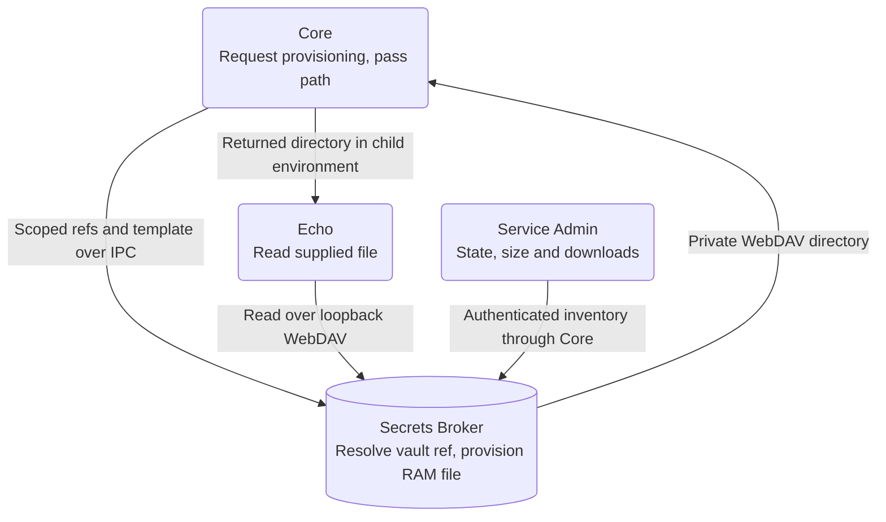

# Advanced - Provision Service Secrets Securely

**Lesson code:** [Complete runnable Echo reference](https://github.com/service-lasso/lasso-echoservice/tree/develop/examples/webdav).
Continue from a working [Service Admin and Echo workspace](../quick-start.md).
This optional advanced lesson uses a separate learning service.

## Outcome

Ask Secrets Broker to provision a secret into a RAM file and return its WebDAV
path. Core passes the path to Echo. Verify size, successful reads, recreation
and denial using the executable checker and Admin's inventory.



The file-only credential stays inside Broker until Echo downloads it.
Core does not request its plaintext through `/v1/resolve` or render it locally.
Explicit secret delivery in `env` remains supported separately.

## Before you start

Use an initialized, unlocked Broker connected to your learning host, with
secret-write permission and workspace-read permission for inventory. Use
matching Core/Broker builds implementing Broker-owned reference-to-file
provisioning, Admin's **Secrets Broker → RAM files** view and Echo's consumer.
Older builds accepting only Core-rendered bytes do not implement this contract.
Publishing documentation does not upgrade installed binaries.

Install Node 22+ and the Go version in Echo's `go.mod` to prepare the sample.
The prepared binary needs no Go installation at runtime. The setup command
refuses an existing `echo-webdav` folder and preserves existing services.

## 1. Prepare the complete service

From a terminal outside your host's services root:

```powershell
git clone --branch develop --single-branch https://github.com/service-lasso/lasso-echoservice.git echo-secret-reference
Set-Location echo-secret-reference
$servicesRoot = Read-Host 'Existing services root for your learning host'
node examples/webdav/prepare.mjs $servicesRoot
```

Linux/macOS:

```bash
git clone --branch develop --single-branch https://github.com/service-lasso/lasso-echoservice.git echo-secret-reference
cd echo-secret-reference
read -r -p 'Existing services root for your learning host: ' servicesRoot
node examples/webdav/prepare.mjs "$servicesRoot"
```

The executable setup compiles Echo and writes its binary and complete manifest
into the new `echo-webdav` service folder. All endpoints, health checks and
secret declarations are retained. Windows uses `./echo-secret-demo.exe`;
Linux/macOS use `./echo-secret-demo`. A failed build leaves the new folder for inspection.

This is the complete Linux/macOS manifest produced by the setup command:

```json
{
  "id": "echo-webdav",
  "name": "Echo RAM WebDAV demo",
  "description": "Go-based harness service used for Service Lasso integration, runtime hardening, and supervision testing.",
  "version": "0.3.0",
  "enabled": true,
  "executable": "./echo-secret-demo",
  "args": [],
  "env": {
    "ECHO_MESSAGE": "hello from echo-service harness",
    "ECHO_PORT": "${endpoint.service.port}",
    "ECHO_HTTP_HEALTH_PORT": "${endpoint.http_health.port}",
    "ECHO_TCP_PORT": "${endpoint.tcp_health.port}",
    "ECHO_LOG_PATH": "./runtime/echo.log",
    "ECHO_STATE_PATH": "./runtime/state.json",
    "ECHO_DB_PATH": "./runtime/echo.sqlite",
    "SERVICE_LASSO_GLOBAL_ENV_JSON": "{\"ECHO_ENV_CHANNEL\":\"demo\"}",
    "ECHO_SECRET_FILES_DIR": "${SERVICE_LASSO_SECRETS_DIR}",
    "ECHO_SECRET_FILE_NAME": "demo-config.json"
  },
  "endpoints": [
    {
      "id": "service",
      "kind": "network",
      "label": "Service HTTP",
      "direction": "inbound",
      "transport": "tcp",
      "protocol": "http",
      "bind": "127.0.0.1",
      "port": {
        "default": 4010,
        "strategy": "preferred"
      },
      "exposure": "local",
      "required": true,
      "primary": true
    },
    {
      "id": "http_health",
      "kind": "network",
      "label": "Dedicated HTTP health",
      "direction": "inbound",
      "transport": "tcp",
      "protocol": "http",
      "bind": "127.0.0.1",
      "port": {
        "default": 4011,
        "strategy": "preferred"
      },
      "exposure": "local",
      "required": true
    },
    {
      "id": "tcp_health",
      "kind": "network",
      "label": "Dedicated TCP health",
      "direction": "inbound",
      "transport": "tcp",
      "protocol": "tcp",
      "bind": "127.0.0.1",
      "port": {
        "default": 4012,
        "strategy": "preferred"
      },
      "exposure": "local",
      "required": true
    },
    {
      "id": "ui",
      "kind": "url",
      "label": "ui",
      "target": "service",
      "url": "http://${endpoint.service.bind}:${endpoint.service.port}/",
      "exposure": "local",
      "required": true,
      "primary": true
    },
    {
      "id": "service_health",
      "kind": "url",
      "label": "service",
      "target": "service",
      "url": "http://${endpoint.service.bind}:${endpoint.service.port}/health",
      "exposure": "local",
      "required": true
    },
    {
      "id": "http_health_url",
      "kind": "url",
      "label": "http-health",
      "target": "http_health",
      "url": "http://${endpoint.http_health.bind}:${endpoint.http_health.port}/health",
      "exposure": "local",
      "required": true
    }
  ],
  "healthchecks": [
    {
      "id": "process-ready",
      "type": "process"
    }
  ],
  "config": {
    "files": [
      {
        "path": "demo-config.json",
        "content": "{\"demoCredential\":\"${echo.DEMO_CREDENTIAL}\"}",
        "ephemeral": true
      }
    ]
  },
  "broker": {
    "imports": [
      {
        "namespace": "shared/echo",
        "ref": "echo.DEMO_CREDENTIAL",
        "required": true
      }
    ]
  }
}
```

## 2. Create the demo secret in Broker

In Service Admin, create namespace `shared/echo`, ref `echo.DEMO_CREDENTIAL`,
value `synthetic-demo-credential`. The full stored reference is
`shared/echo/echo.DEMO_CREDENTIAL`. Use this synthetic value for the lesson;
actual credentials belong in Broker, not in checked-in manifests.

| Configuration | Meaning |
| --- | --- |
| `broker.imports[].namespace` and `ref` | Bind the template selector to its permitted stored reference. |
| `required: true` | Broker must find and authorize this reference; failure prevents spawn. |
| `config.files[].ephemeral: true` | Ask Broker to provision the named file in RAM. |
| `content` | A secret-free template; Broker substitutes the reference internally. |
| `${SERVICE_LASSO_SECRETS_DIR}` | The private WebDAV directory returned by Broker and supplied at launch. |
| `ECHO_SECRET_FILE_NAME` | Echo appends `demo-config.json` and reads it. |

An import alone does not create a file. The ephemeral declaration requests
provisioning. `_FILE` names are app conventions; choose variables your consumer
understands. Single-value files can use `${database.PASSWORD}` as content and
`${SERVICE_LASSO_SECRETS_DIR}/password` as an app-supported path variable.
Packaged secret-free templates use `config.templates[].ephemeral: true`.
Broker substitutes text; it does not JSON-escape arbitrary credentials.
The lesson value is JSON-safe. Arbitrary raw values suit a single-value file.

## 3. Start through Core

Refresh discovery; Install, Configure and Start `echo-webdav` in Admin.
The prepared sample requires no manual manifest assembly.

1. Core sends output names, secret-free templates and selector/ref bindings
   with a fresh service/workspace/peer-bound launch lease.
2. Broker authorizes and resolves internally, provisions bounded RAM files
   and returns the private WebDAV directory.
3. Core supplies that directory through the child environment and starts Echo.
   No file-only plaintext resolve response returns to Core.
4. Echo reads and validates the JSON, exposing only safe status.

Starting Echo directly cannot provision its file. Windows receives a UNC
directory; Linux/macOS receive an HTTP directory. Echo converts Windows UNC
to loopback HTTP, so this sample needs no mapping or WebClient setup.
URLs are not POSIX paths. Native Linux files require the explicitly selected
[tmpfs alternative](../reference/linux-app-secret-files.md).

## 4. Run the checker and inspect usage

Copy Echo's allocated **Service HTTP** origin from Admin's Network view.
From the example checkout:

```powershell
$echoOrigin = Read-Host 'Echo Service HTTP origin (http://127.0.0.1:<port>)'
node examples/webdav/check.mjs $echoOrigin
```

Linux/macOS: `node examples/webdav/check.mjs "$echoOrigin"` with the allocated
origin. Do not assume port 4010. The executable checker verifies startup loaded
a file, rereads it and requires the successful read counter to advance.
For this exact synthetic value, a first check on an idle instance prints:

```json
{ "status": "loaded", "sizeBytes": 46, "reads": 2 }
```

It exits nonzero for unavailable files, remote/redirected endpoints, invalid
status or a counter that does not advance. `GET /secret-file` exposes safe
status; `POST /secret-file` rereads. Ordinary Echo health alone is insufficient.

Open **Secrets Broker → RAM files**, filter `echo-webdav` and Refresh files.
Inspect listener state, RAM usage, ownership, size, completed downloads,
bytes served and last access. `demo-config.json` should match Echo's size and
show two downloads after startup and one checker run if there are no other
readers. Repeat the checker to compare changes. HEAD/listings do not increment
completed downloads. The page polls every 30 seconds; search/sort apply to
the current page. Contents and capability tokens stay private. Server counters
measure completed writes; Echo's status proves its received JSON was valid.

## 5. Verify recreation and failure

1. Stop only this learning service through Core: its grant disappears.
2. Start again: Broker provisions a fresh path/file from the current vault
   value; counters restart. Configured state does not skip fresh provisioning.
3. Stop, remove only the synthetic reference and try Start: provisioning must
   fail before spawn. Restore it to recover. Preserve real application secrets.

Replacement invalidates the old capability. Broker restart loses RAM grants;
fresh launches provision again. Already-running/adopted processes retain their
grant. A Core crash alone does not revoke surviving Broker grants. When
revocation IPC fails, restore Broker and retry the normal pending action.
Recreating a file does not rotate the vault secret.

## If the result differs

| Symptom | Check |
| --- | --- |
| Setup refuses the folder | Preserve the existing service; use a separate learning host/root. |
| Provisioning fails before spawn | Matching API, namespace/ref policy, unlocked vault, relative names and RAM limits. No disk fallback. |
| Echo reports unavailable | Consumer environment entries, matching binary and valid JSON. |
| Inventory is empty | Start this file consumer; environment-only imports create no files. |
| Inventory denies access | Workspace-read permission and matching Core/Broker/Admin builds. |
| Another app rejects the path | Confirm HTTP/DAV or Windows UNC support; native Linux files require tmpfs. |

Use safe metadata for screenshots/support. Capability paths are credentials
even on loopback. Consumers can still copy or log the bytes they receive.

## Next steps

Read the [complete runnable reference](https://github.com/service-lasso/lasso-echoservice/tree/develop/examples/webdav),
[service.json reference](../reference/service-json-reference.md),
[startup resolution](../reference/startup-broker-resolution.md) and
[RAM WebDAV delivery contract](../reference/ram-webdav-secret-files-review.md).
