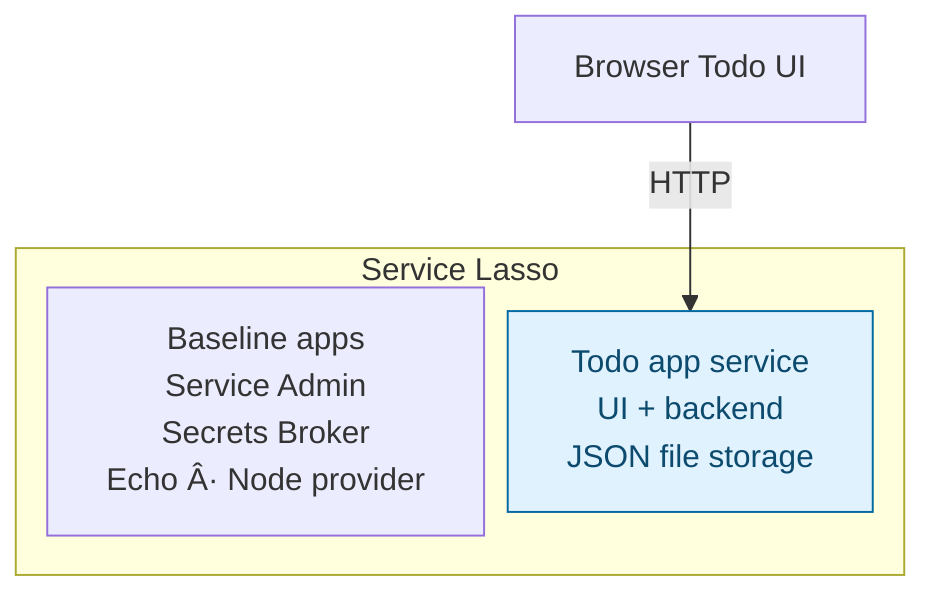

# Beginner — Add a Todo app service

Add your first application service to Service Lasso. You will register a small
Todo web app, start it through Lasso, inspect its health and endpoint in Admin,
and prove that its data survives a managed stop/start.

**Success:** `todo-app` appears in Admin, is healthy, accepts a new todo and keeps
it after refresh and a service restart.

## Outcome

**Stage 1: Add a managed Todo app.** The Todo app runs inside Service Lasso from
the first lesson. Every application process shown inside the boundary is managed
by Lasso; the browser connects to the Todo service's allocated web endpoint.



Blue highlights what this lesson adds. Solid arrows show application traffic.
Service Admin operates the services in the boundary; Lasso installs, starts,
stops, allocates ports and monitors their health. The JSON file in stage 1 is
Todo service data, not another service. Other runtime support packages are omitted.

## 1. Start Lasso and sign in to Admin

You need Node.js 22+, npm, Git and internet access for the first service download.

```sh
git clone --branch develop https://github.com/service-lasso/service-lasso.git
cd service-lasso
npm ci
npm run demo
```

Open [Service Admin](http://127.0.0.1:17700/). Complete first-run setup, save the
local credential and recovery material privately, acknowledge that you saved
them, and sign in. Confirm the baseline services are visible and healthy.
If baseline setup completed but services remain stopped, run `npm run demo:recycle`
from another terminal in this checkout.

Admin login authorizes service management. The local Todo example has no user
login; it binds to loopback only. User authentication is a later lesson with
[ZITADEL SSO Hub](zitadel-sso-hub.md). Signing in to Admin does not sign users
into another application.

## 2. Add the Todo service to the inventory

Stop your demo with `Ctrl+C` (or `npm run demo:stop`). From the checkout root:

```sh
node examples/getting-started-todo/add.mjs
```

The demo runs its inventory from `workspace/canonical-services-root/`; the
checked-in `services/` folder is its baseline seed source. Add your new service
to the running inventory, not the seed folder.

This copies the checked-in example into `workspace/canonical-services-root/todo-app/` without overwriting
an existing service. It contains:

```text
workspace/canonical-services-root/todo-app/
  service.json
  package.json
  package-lock.json
  runtime/
    server.mjs
    index.html
    database.mjs
  data/todos.json       # created when you save the first todo
```

The Node server serves the UI, `GET /todos`, `POST /todos` and `GET /healthz`.
It reads and writes its own JSON file. No database service is needed yet.

Open `workspace/canonical-services-root/todo-app/service.json` and identify the pieces Lasso uses:

| Manifest field | What you are learning |
| --- | --- |
| `id: todo-app` | Identity in the service inventory and Admin |
| `depend_on: [@node]`, `execservice: @node` | Use Lasso's managed Node provider to run the app |
| `args` | Launch this service's `runtime/server.mjs` |
| `endpoints` | Declare a loopback web listener; prefer port 18552, allow allocation to choose another |
| `env.TODO_PORT` | Supply the allocated web port to the process |
| `env.TODO_DATA_FILE` | Keep data in this service's `data/` folder |
| `healthchecks` | Check the running app's `/healthz` endpoint |

See the [manifest source](https://github.com/service-lasso/service-lasso/blob/develop/examples/getting-started-todo/service.json)
and [endpoint contract](../reference/endpoints-contract.md). The beginner app uses
only Node built-ins; the checked-in npm dependencies are used by the next lesson.

## 3. Discover and start it through Lasso

```sh
npm run demo
```

Restarting Lasso discovers the new manifest. Enabled services may autostart.
In Admin, open **Services → Todo App**:

1. Confirm `todo-app` and its Node dependency appear.
2. Use **Start** if it is stopped; wait for the HTTP health check to pass.
3. Under **Runtime**, inspect its managed process.
4. Under **Network**, open the resolved UI URL. Do not assume the preferred port
   was available; use the allocation Admin shows.
5. Under **Logs**, find the `Todo app ready` message.

Do not run `server.mjs` in a second terminal. Lasso owns the app's process.

## 4. Verify data and managed lifecycle

1. Open the Todo UI from its Admin Network URL.
2. Add a todo with a unique title.
3. Refresh the page and confirm it remains.
4. In Admin, **Stop** only `todo-app`, confirming the action if prompted.
5. Confirm the Todo URL is unavailable while the service is stopped.
6. In Admin, **Start** `todo-app`, wait for healthy, and reopen its resolved URL.
7. Confirm the same todo remains. Inspect `workspace/canonical-services-root/todo-app/data/todos.json`
   if you want to see the storage you just created.

**Pass:** Lasso starts/stops the app and its data survives restart.
**Fail:** inspect the service logs, allocated port and data directory. If the UI
works while Admin reports this service stopped, you may be testing a manually
started process; stop that process and repeat using Lasso.

## Stop and keep your work

Stop `todo-app` through Admin. Stop this demo with `Ctrl+C` or `npm run demo:stop`.
Keep the service folder and its data. Do not rerun the add command to restart it.

## Next

[Add PostgreSQL to this same managed app](intermediate-make-todo-app-durable.md),
then [add a Go Todo API service](advanced-add-go-todo-api-service.md).
