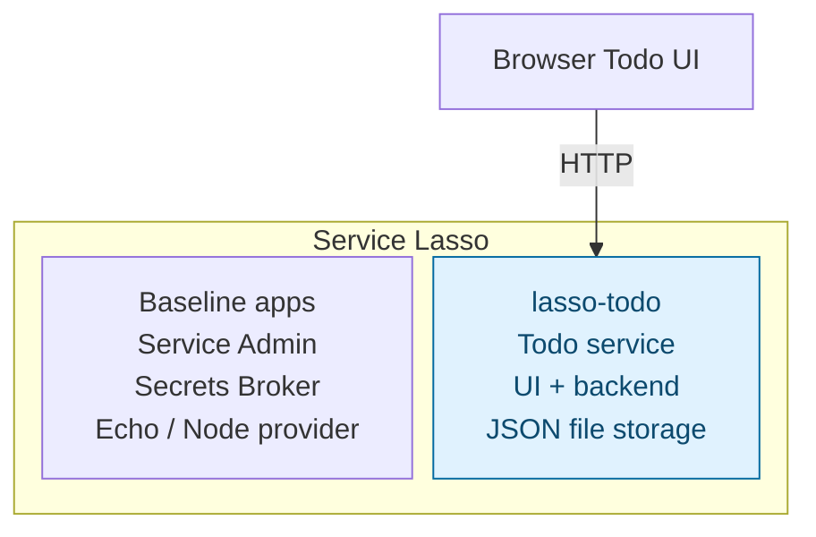

# Beginner — Add a Todo app service

Add your first application service to Service Lasso. You will register a small
Todo web app, start it through Lasso, inspect its health and endpoint in Admin,
and prove that its data survives a managed stop/start.

**Success:** `todo` appears in Admin, is healthy, accepts a new todo and keeps
it after refresh and a service restart.

## Outcome

**Stage 1: Add a managed Todo app.** The Todo app runs inside Service Lasso from
the first lesson. Every application process shown inside the boundary is managed
by Lasso; the browser connects to the Todo service's allocated web endpoint.



Blue highlights what this lesson adds. Solid arrows show application traffic.
Service Admin operates the services in the boundary; Lasso installs, starts,
stops, allocates ports and monitors their health. The JSON file in stage 1 is
Todo service data, not another service. Other runtime support packages are omitted.

## 1. Start Lasso and sign in to Admin

Use Node.js 22+, npm, Git and internet access. In a new learning workspace:

```powershell
git clone --branch develop --single-branch https://github.com/service-lasso/service-lasso.git
cd service-lasso
npm ci
npm run demo
```

Open [Service Admin](http://127.0.0.1:17700/). Complete first-run setup, privately save and acknowledge the credential/recovery material, then sign in. Confirm the baseline services. Keep this terminal running; use another terminal for the commands below. Admin login authorizes management; Todo has no user login and binds to loopback. [ZITADEL](zitadel-sso-hub.md) addresses a later authentication stage.

## 2. Inspect a proper template-derived service

The application belongs in [service-lasso/lasso-todo](https://github.com/service-lasso/lasso-todo), created through GitHub's template flow from [service-template](https://github.com/service-lasso/service-template). It owns its manifest, runtime, packaging, verification and release workflow.

From the Core checkout in your second terminal:

```powershell
git clone --branch develop --single-branch https://github.com/service-lasso/lasso-todo.git ../lasso-todo
gh api repos/service-lasso/lasso-todo --jq '.template_repository.full_name'
npm --prefix ../lasso-todo ci
npm --prefix ../lasso-todo test
npm --prefix ../lasso-todo run package
npm --prefix ../lasso-todo run verify
```

The query must print <code>service-lasso/service-template</code>. <code>gh</code> is GitHub CLI; install/sign in if needed. The service's <code>template-origin.json</code> records its exact development baseline.

To author your own service, follow the [template bootstrap guide](../components/service-template/bootstrap-new-service-repo.md) and use this Todo repository as the reference implementation. Retain GitHub template provenance, use an issue branch from <code>develop</code>, and adapt the package/test/verify contract.

| File in lasso-todo | What you learn |
| --- | --- |
| service.json | Identity, provider dependency, archive, endpoint and health |
| runtime/server.mjs and runtime/index.html | Actual UI/API and JSON persistence |
| scripts/package.ps1 / .sh | Package runtime and locked SQL driver dependencies |
| scripts/test.ps1 / .sh | Input, create/list and persistence checks |
| scripts/verify.ps1 / .sh | Execute a freshly extracted package |
| .github/workflows/release.yml | Platform archives, released manifest and checksums |

Your local package proves the authoring step. Next consume a published development candidate; a local build and released import are separate.

## 3. Import the released manifest and start through Lasso

```powershell
node dist/cli.js services import service-lasso/lasso-todo --tag 2026.10.4-b6d089f --services-root workspace/canonical-services-root --workspace-root workspace/demo-instance --dry-run --json
node dist/cli.js services import service-lasso/lasso-todo --tag 2026.10.4-b6d089f --services-root workspace/canonical-services-root --workspace-root workspace/demo-instance
```

Import writes the released manifest to <code>workspace/canonical-services-root/todo/service.json</code>. This is the demo's running inventory; checked-in <code>services/</code> supplies baseline seed manifests. Import refuses to overwrite an existing service. Keep data and inspect conflicts; force is not a routine restart step.

Refresh the Admin page to read the updated inventory. **Reload runtime** stops and restarts services; it is not needed for discovery. Open **Todo**, use **Install** and **Configure** if offered, then **Start** and wait for healthy. Lasso acquires the pinned, checksum-verified archive and uses managed <code>@node</code> to run the server from the acquired artifact. Open its actual Network URL; 18552 is a preference, not a promise.

Inspect dependencies, acquired release/checksum, process, logs, health and Network views. The app exposes <code>GET /</code>, <code>GET /todos</code>, <code>POST /todos</code> and <code>GET /healthz</code>. Its JSON data stays in the service's <code>data/todos.json</code>, outside the acquired archive.

## 4. Verify data and service lifecycle

1. Add a todo with a unique title in the browser and refresh.
2. Stop only **Todo** in Admin, confirming when prompted.
3. Confirm its allocated URL is unavailable.
4. Start Todo through Admin, wait for healthy and reopen its resolved URL.
5. Confirm the same todo remains; inspect <code>workspace/canonical-services-root/todo/data/todos.json</code>.

**Pass:** the acquired service runs inside Lasso and data survives managed stop/start. A manually launched second copy is not this verification.

Stop Todo through Admin when finished and preserve inventory/data. Whole-demo shutdown/recycle remains unqualified [#1665](https://github.com/service-lasso/service-lasso/issues/1665); service-specific checks do not establish that broader gate. See the [independent review](../development/documented-examples-verification.md).

Next: [add PostgreSQL](intermediate-make-todo-app-durable.md), then [add the template-derived Go API](advanced-add-go-todo-api-service.md).
