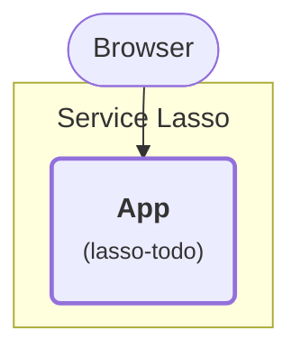

# Beginner — Add a Todo app service

**Lesson code:** [01 — App](https://github.com/service-lasso/lesson-todo/tree/develop/lessons/01-app).
The folder contains this stage's service inventory, architecture and standalone
run instructions. Browse [all five checkpoints](https://github.com/service-lasso/lesson-todo/tree/develop/lessons)
to see the application grow. Use the runnable checkpoint below, or follow the Core demo authoring route later in this article.

Add your first application service to Service Lasso. You will register a small
Todo web app, start it through Lasso, inspect its health and endpoint in Admin,
and prove that its data survives a managed stop/start.

**Success:** `todo` appears in Admin, is healthy, accepts a new todo and keeps
it after refresh and a service restart.

## Outcome

**Stage 1: Add the App.** The App stores todos in its own JSON file.

<div className="tutorial-architecture">



</div>

The highlighted service is new in this lesson. Everything inside the boundary is managed by Service Lasso.

| Purpose | Service | Responsibility / data path |
| --- | --- | --- |
| App | `lasso-todo` (`todo`) | Serve the browser UI and save todos in `${SERVICE_ROOT}/data/todos.json`. |

<details>
<summary>Existing platform services</summary>

These services also run inside Service Lasso. They support the application path shown above.

| Purpose | Service | Responsibility |
| --- | --- | --- |
| Management | `lasso-serviceadmin` (`@serviceadmin`) | Install, configure, start and stop services; show health and endpoints. |
| Secrets | `lasso-secretsbroker` (`@secretsbroker`) | Provide the platform's managed secret delivery. |
| Example | `echo-service` | The starter service already included in the demo. |
| Runtime | `lasso-node` (`@node`) | Run the App's packaged JavaScript. |

</details>


## Run the published lesson checkpoint

Use Node.js 22, npm, Git and internet access. Clone the lesson repository into a new learning folder:

```sh
git clone --branch develop --single-branch https://github.com/service-lasso/lesson-todo.git
cd lesson-todo
npm ci
npm run setup -- 01
npm run lesson:01
```

The host uses published Core and Admin and acquires the pinned service archives;
no sibling build is needed. Open the printed loopback Admin URL, complete
**Initialize Secrets Broker**, privately save and acknowledge its recovery
material, and continue as local-root. Install/configure/start the application
services in Admin, dependencies first, then open Todo's allocated Network URL.

Fresh Intel macOS 11 checkpoints automatically select compatible Broker and
managed Node 22 profiles for the machine's OS and CPU. Apple Silicon is a separate
compatibility case; consult the [lesson platform prerequisites](https://github.com/service-lasso/lesson-todo#platform-prerequisites).
Setup preserves existing manifests and data: retained Node 24 requires macOS
13.5 or newer, and the older Broker requires macOS 12. Use a separate fresh
learning folder for the new pins; do not overwrite a retained workspace.

Add a Todo in its browser UI, refresh, stop and start Todo in Admin, then confirm the same item remains.

Type `shutdown` in the host terminal to stop this owned checkpoint. Restart
with `npm run lesson:01`, then start managed services in Admin again,
dependencies first. Host restart preserves data and does not automatically
start the application stack. Do not run two hosts against one checkpoint.
Checkpoints have separate state and do not copy data automatically.

The first three stages use local learning access. [SSO](zitadel-sso-hub.md)
has separate identity and platform prerequisites; this route does not establish
Mac SSO support. The [desktop stage](package-todo-tauri.md) builds on Windows x64.

## Core demo authoring route

The steps below teach source packaging and manual imports in the Core demo.
Their existing provider pins are separate from the fresh lesson checkpoint's
Mac-compatible selection. On Intel macOS 11, use the checkpoint above.

## 1. Start Lasso and sign in to Admin

Use Node.js 22+, npm, Git and internet access. In a new learning workspace:

```powershell
git clone --branch develop --single-branch https://github.com/service-lasso/service-lasso.git
cd service-lasso
npm ci
npm run demo
```

Open [Service Admin](http://127.0.0.1:17700/). Complete first-run setup, privately save and acknowledge the credential/recovery material, then sign in. Confirm the baseline services. Keep this terminal running; use another terminal for the commands below. Admin login authorizes management; Todo has no user login and binds to loopback. [ZITADEL](zitadel-sso-hub.md) addresses a later authentication stage.

## 2. Inspect a proper template-derived service

The application belongs in [service-lasso/lasso-todo](https://github.com/service-lasso/lasso-todo), created through GitHub's template flow from [service-template](https://github.com/service-lasso/service-template). It owns its manifest, runtime, packaging, verification and release workflow.

From the Core checkout in your second terminal:

```powershell
git clone --branch develop --single-branch https://github.com/service-lasso/lasso-todo.git ../lasso-todo
gh api repos/service-lasso/lasso-todo --jq '.template_repository.full_name'
npm --prefix ../lasso-todo ci
npm --prefix ../lasso-todo test
npm --prefix ../lasso-todo run package
npm --prefix ../lasso-todo run verify
```

The query must print <code>service-lasso/service-template</code>. <code>gh</code> is GitHub CLI; install/sign in if needed. The service's <code>template-origin.json</code> records its exact development baseline.

To author your own service, follow the [template bootstrap guide](../components/service-template/bootstrap-new-service-repo.md) and use this Todo repository as the reference implementation. Retain GitHub template provenance, use an issue branch from <code>develop</code>, and adapt the package/test/verify contract.

| File in lasso-todo | What you learn |
| --- | --- |
| service.json | Identity, provider dependency, archive, endpoint and health |
| runtime/server.mjs and runtime/index.html | Actual UI/API and JSON persistence |
| scripts/package.ps1 / .sh | Package runtime and locked SQL driver dependencies |
| scripts/test.ps1 / .sh | Input, create/list and persistence checks |
| scripts/verify.ps1 / .sh | Execute a freshly extracted package |
| .github/workflows/release.yml | Platform archives, released manifest and checksums |

Your local package proves the authoring step. Next consume a published development candidate; a local build and released import are separate.

## 3. Import the released manifest and start through Lasso

```powershell
node dist/cli.js services import service-lasso/lasso-todo --tag 2026.10.4-b6d089f --services-root workspace/canonical-services-root --workspace-root workspace/demo-instance --dry-run --json
node dist/cli.js services import service-lasso/lasso-todo --tag 2026.10.4-b6d089f --services-root workspace/canonical-services-root --workspace-root workspace/demo-instance
```

Import writes the released manifest to <code>workspace/canonical-services-root/todo/service.json</code>. This is the demo's running inventory; checked-in <code>services/</code> supplies baseline seed manifests. Import refuses to overwrite an existing service. Keep data and inspect conflicts; force is not a routine restart step.

Refresh the Admin page to read the updated inventory. **Reload runtime** stops and restarts services; it is not needed for discovery. Open **Todo**, use **Install** and **Configure** if offered, then **Start** and wait for healthy. Lasso acquires the pinned, checksum-verified archive and uses managed <code>@node</code> to run the server from the acquired artifact. Open its actual Network URL; 18552 is a preference, not a promise.

Inspect dependencies, acquired release/checksum, process, logs, health and Network views. The app exposes <code>GET /</code>, <code>GET /todos</code>, <code>POST /todos</code> and <code>GET /healthz</code>. Its JSON data stays in the service's <code>data/todos.json</code>, outside the acquired archive.

## 4. Verify data and service lifecycle

1. Add a todo with a unique title in the browser and refresh.
2. Stop only **Todo** in Admin, confirming when prompted.
3. Confirm its allocated URL is unavailable.
4. Start Todo through Admin, wait for healthy and reopen its resolved URL.
5. Confirm the same todo remains; inspect <code>workspace/canonical-services-root/todo/data/todos.json</code>.

**Pass:** the acquired service runs inside Lasso and data survives managed stop/start. A manually launched second copy is not this verification.

Stop Todo through Admin when finished and preserve inventory/data. Whole-demo shutdown/recycle remains unqualified [#1665](https://github.com/service-lasso/service-lasso/issues/1665); service-specific checks do not establish that broader gate. See the [independent review](../development/documented-examples-verification.md).

Next: [add PostgreSQL](intermediate-make-todo-app-durable.md), then [add the template-derived Go API](advanced-add-go-todo-api-service.md).
