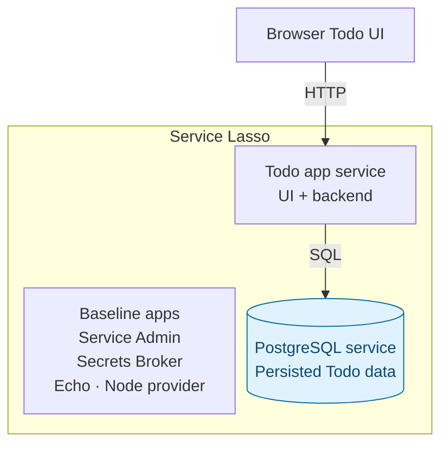

# Intermediate — Add PostgreSQL to the Todo service

Continue the [managed Todo app lesson](beginner-todo-app.md). Add a second service,
PostgreSQL, to the same Lasso inventory and make the Todo service depend on it.
You will learn release import, install, dependency startup, runtime allocation,
health, database storage and restart recovery.

## Outcome

**Stage 2: Add managed PostgreSQL.** The Todo app runs inside Service Lasso from
the first lesson. Every application process shown inside the boundary is managed
by Lasso; the browser connects to the Todo service's allocated web endpoint.



Blue highlights what this lesson adds. Solid arrows show application traffic.
Service Admin operates the services in the boundary; Lasso installs, starts,
stops, allocates ports and monitors their health. The JSON file in stage 1 is
Todo service data, not another service. Other runtime support packages are omitted.

## 1. Add and install PostgreSQL

Keep the same checkout and `workspace/canonical-services-root/todo-app` from the beginner lesson. Stop
your demo before changing its inventory:

```sh
npm run demo:stop
# Wait for this demo to report stopped and its process to exit.
node examples/getting-started-todo/add-stage.mjs postgres
```

The helper imports the pinned `service-lasso/lasso-postgres` release
`2026.5.3-ddd9e47` (PostgreSQL 15.17), installs its binaries, and configures the
existing foreground launcher so Lasso retains process ownership. It keeps the
database under `workspace/canonical-services-root/postgres/data/database`, installs the Todo service's
locked PostgreSQL driver, and changes the Todo dependency to `[@node, postgres]`.
It refuses to overwrite an existing PostgreSQL service or database.

Inspect `workspace/canonical-services-root/postgres/service.json` and `workspace/canonical-services-root/todo-app/service.json`.
The helper is a local tutorial setup tool; the database binaries are the pinned
release. In the Todo manifest, `TODO_DATABASE_STATE` identifies PostgreSQL's
runtime allocation file. On launch, the app reads the actual allocated database
port, rather than assuming the proposed port 18551 was available.

The tutorial uses loopback-only `pgadmin` / `pgadmin` credentials and database
`postgres`. These are public local example defaults. An app you distribute needs
[secret references and policies](../reference/service-secret-access-policy.md).
The pinned macOS PostgreSQL archive is Intel; Apple Silicon is not qualified.

## 2. Start the dependent services

```sh
npm run demo
```

In Admin:

1. Confirm **PostgreSQL** and **Todo App** appear in Services.
2. Inspect Todo's dependencies: Node provider and PostgreSQL.
3. Start PostgreSQL if needed, then Todo; wait for healthy.
4. Inspect PostgreSQL's allocated port under Network and both process/log views.
5. Open the Todo UI from Todo's Network URL.

The Todo service now creates/reads `tutorial_todos` in PostgreSQL. Existing
beginner JSON todos are inserted with their original IDs; repeated starts do not
duplicate them. The file is retained for recovery, but new todos go to PostgreSQL.

## 3. Prove persistence and dependency recovery

1. Create a todo with a new unique title and refresh the UI.
2. Stop Todo in Admin, then stop PostgreSQL; confirm the database is stopped.
3. Start PostgreSQL, then Todo, waiting for healthy; reopen Todo's resolved URL.
4. Confirm both the old beginner todo and new database-backed todo remain.
5. Inspect logs if a database dependency is unavailable. An HTTP response from a
   live UI is not enough: create/list and the dependency health must work.

To try configuration, stop both services and set `POSTGRES_MAX_CONNECTIONS` to
`"120"` in `workspace/canonical-services-root/postgres/service.json` under `env`. Restart the demo so it
reloads the edited manifest, start the services and repeat create/list. Keep the
database directory; changing a manifest password does not rotate an initialized
PostgreSQL account.

## What you added to Lasso

PostgreSQL is a new managed service. Todo remains a managed service and uses a
normal SQL driver. Lasso handles install, start order, health, logs and allocated
ports; the app handles Todo data. Read the [setup helper](https://github.com/service-lasso/service-lasso/blob/develop/examples/getting-started-todo/add-stage.mjs)
and [database adapter](https://github.com/service-lasso/service-lasso/blob/develop/examples/getting-started-todo/runtime/database.mjs)
to see the wiring.

## Supplementary database-only example

`examples/postgres-app` is a separate database smoke example with its own
workspace and unmanaged HTTP wrapper. It is useful for inspecting the pinned
package and SQL check, but it is **not** the cumulative Todo tutorial and should
not replace the managed Todo steps above. See its [README](https://github.com/service-lasso/service-lasso/blob/develop/examples/postgres-app/README.md).

## Stop and next

Stop Todo, then PostgreSQL through Admin, or stop your whole demo with
`npm run demo:stop`. Preserve both service folders and data.

[Add the Go Todo API as the next managed service](advanced-add-go-todo-api-service.md).
