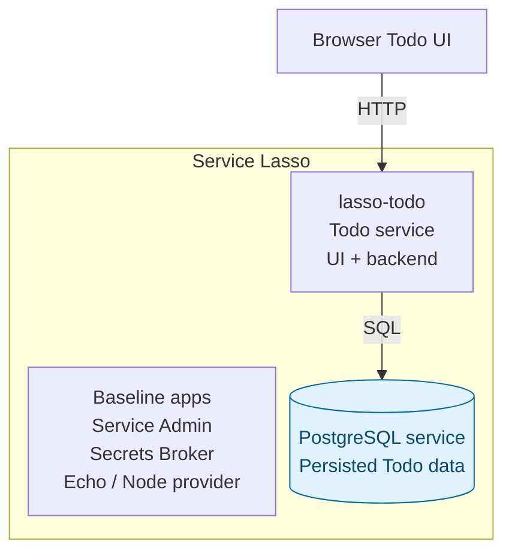

# Intermediate — Add PostgreSQL to the Todo service

Continue the [managed Todo app lesson](beginner-todo-app.md). Add a second service,
PostgreSQL, to the same Lasso inventory and make the Todo service depend on it.
You will learn release import, install, dependency startup, runtime allocation,
health, database storage and restart recovery.

## Outcome

**Stage 2: Add managed PostgreSQL.** The Todo app runs inside Service Lasso from
the first lesson. Every application process shown inside the boundary is managed
by Lasso; the browser connects to the Todo service's allocated web endpoint.



Blue highlights what this lesson adds. Solid arrows show application traffic.
Service Admin operates the services in the boundary; Lasso installs, starts,
stops, allocates ports and monitors their health. The JSON file in stage 1 is
Todo service data, not another service. Other runtime support packages are omitted.

## 1. Import PostgreSQL into the same inventory

Keep the <code>todo</code> service and JSON data from the first lesson. Stop Todo through Admin and confirm its endpoint is unavailable. In your Core checkout terminal:

```powershell
node dist/cli.js services import service-lasso/lasso-postgres --tag 2026.5.3-ddd9e47 --services-root workspace/canonical-services-root --workspace-root workspace/demo-instance
node examples/postgres-app/configure-managed-service.mjs workspace/canonical-services-root/postgres
```

The second command is an **explicit local PostgreSQL adapter** for this pinned release. Its default database directory contains an installed <code>.keep</code> file that makes first initialization fail, and its first-boot launcher can detach. Those published-provider defects remain open as [#1667](https://github.com/service-lasso/service-lasso/issues/1667).

The adapter pins that exact release, selects the service's <code>data/database</code> directory, adds managed <code>@node</code> and places a foreground launcher under <code>tutorial-runtime/</code>. Database binaries still come from the release. Data is preserved and an existing adapter is not overwritten. This does not claim that PostgreSQL's published defaults are fixed.

Refresh Admin, select PostgreSQL, Install/Configure if offered, then Start and wait for healthy. Inspect its process tree, logs and allocated SQL port. The adapter keeps the database process beneath its managed launcher.

## 2. Configure the template-derived Todo service for SQL

While Todo remains stopped, from Core:

```powershell
node ../lasso-todo/scripts/configure-stage.mjs workspace/canonical-services-root/todo postgres
```

Inspect <code>todo/service.json</code>: dependencies now include <code>@node</code> and <code>postgres</code>, and <code>TODO_DATABASE_STATE</code> points to the database runtime allocation file. Refresh Admin and start Todo. It reads the real SQL port, creates <code>tutorial_todos</code> and seeds saved JSON rows with their original IDs. Repeated starts do not duplicate them. JSON remains for recovery; new writes go to SQL. The locked SQL driver is already in Todo's acquired package.

| Service | Responsibility |
| --- | --- |
| todo, from lasso-todo | UI/API, validation, migration and SQL queries |
| postgres, from lasso-postgres | Persist Todo rows |
| @node | Managed runtime provider for Todo and the local foreground adapter |

The isolated tutorial uses <code>pgadmin</code> / <code>pgadmin</code> and database <code>postgres</code>. These are public local defaults. A distributed application needs [secret references and policies](../reference/service-secret-access-policy.md). The pinned PostgreSQL macOS archive is Intel; Apple Silicon is not qualified.

## 3. Prove persistence and dependency recovery

1. Open Todo's allocated UI URL and confirm the beginner todo remains.
2. Add a new SQL-backed todo and refresh.
3. Stop Todo, then PostgreSQL through Admin, confirming the actions.
4. Confirm both are stopped and their listeners are unavailable.
5. Start PostgreSQL, then Todo, waiting for healthy.
6. Confirm old and new IDs remain.

For a configuration exercise, stop both services, set <code>POSTGRES_MAX_CONNECTIONS</code> to <code>120</code> under PostgreSQL's environment, refresh Admin and restart in dependency order. Preserve the database directory. Changing a manifest password does not rotate an initialized database account.

**Pass:** the template-derived Todo package uses a second managed service and data survives service-specific restart. An HTTP200 from the UI alone does not prove SQL persistence. Keep the adapter limitation in your evidence.

The separate <code>examples/postgres-app</code> smoke app is supplementary; its unmanaged HTTP wrapper is not the main Todo journey. Todo source is owned by [lasso-todo](https://github.com/service-lasso/lasso-todo).

Next: [add the template-derived Go API](advanced-add-go-todo-api-service.md). Stop services through Admin when finished and keep data. Whole-demo shutdown/recycle remains unqualified [#1665](https://github.com/service-lasso/service-lasso/issues/1665).
