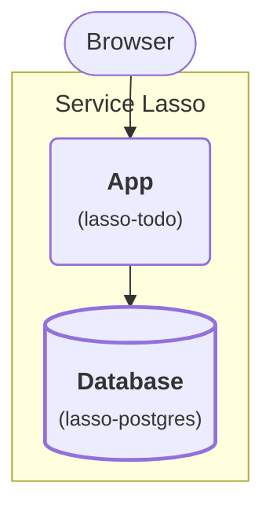

# Intermediate — Add PostgreSQL to the Todo service

**Lesson code:** [02 — Database](https://github.com/service-lasso/lesson-todo/tree/develop/lessons/02-database).
The folder contains this stage's complete service inventory, architecture and
standalone run instructions, with the changes from the App checkpoint.
Use the runnable checkpoint below, or continue the Core demo authoring route later in this article.

Continue the [managed Todo app lesson](beginner-todo-app.md). Add a second service,
PostgreSQL, to the same Lasso inventory and make the Todo service depend on it.
You will learn release import, install, dependency startup, runtime allocation,
health, database storage and restart recovery.

## Outcome

**Stage 2: Add the Database.** The same App now saves todos in the Database.

<div className="tutorial-architecture">



</div>

The highlighted service is new in this lesson. Everything inside the boundary is managed by Service Lasso.

| Purpose | Service | Responsibility / data path |
| --- | --- | --- |
| App | `lasso-todo` (`todo`) | Serve the UI; migrate the original JSON todos and read/write SQL. |
| Database | `lasso-postgres` (`postgres`) | Persist todos in `${SERVICE_ROOT}/runtime/data`; the App connects to its allocated SQL endpoint. |

<details>
<summary>Existing platform services</summary>

These services also run inside Service Lasso. They support the application path shown above.

| Purpose | Service | Responsibility |
| --- | --- | --- |
| Management | `lasso-serviceadmin` (`@serviceadmin`) | Install, configure, start and stop services; show health and endpoints. |
| Secrets | `lasso-secretsbroker` (`@secretsbroker`) | Provide the platform's managed secret delivery. |
| Example | `echo-service` | The starter service already included in the demo. |
| Runtime | `lasso-node` (`@node`) | Run the App's packaged JavaScript. |

</details>


## Run the published lesson checkpoint

In the lesson repository from the previous article, prepare this separate checkpoint:

```sh
npm ci
npm run setup -- 02
npm run lesson:02
```

The host uses published Core and Admin and acquires the pinned service archives;
no sibling build is needed. Open the printed loopback Admin URL, complete
**Initialize Secrets Broker**, privately save and acknowledge its recovery
material, and continue as local-root. Install/configure/start the application
services in Admin, dependencies first, then open Todo's allocated Network URL.

Fresh Intel macOS 11 checkpoints automatically select compatible Broker and
managed Node 22 profiles for the machine's OS and CPU. Apple Silicon is a separate
compatibility case; consult the [lesson platform prerequisites](https://github.com/service-lasso/lesson-todo#platform-prerequisites).
Setup preserves existing manifests and data: retained Node 24 requires macOS
13.5 or newer, and the older Broker requires macOS 12. Use a separate fresh
learning folder for the new pins; do not overwrite a retained workspace.

To carry your JSON history forward, stop both checkpoint hosts and back up `.workspace/01-app/services/todo/data/todos.json`. Copy it to `.workspace/02-database/services/todo/data/todos.json` before the first SQL start, only when the destination does not exist. Start PostgreSQL before Todo. Confirm the original items, add a new item, refresh and restart both services in dependency order.

Type `shutdown` in the host terminal to stop this owned checkpoint. Restart
with `npm run lesson:02`, then start managed services in Admin again,
dependencies first. Host restart preserves data and does not automatically
start the application stack. Do not run two hosts against one checkpoint.
Checkpoints have separate state and do not copy data automatically.

The first three stages use local learning access. [SSO](zitadel-sso-hub.md)
has separate identity and platform prerequisites; this route does not establish
Mac SSO support. The [desktop stage](package-todo-tauri.md) builds on Windows x64.

## Core demo authoring route

The steps below teach source packaging and manual imports in the Core demo.
Their existing provider pins are separate from the fresh lesson checkpoint's
Mac-compatible selection. On Intel macOS 11, use the checkpoint above.

## 1. Import PostgreSQL into the same inventory

Keep the <code>todo</code> service and JSON data from the first lesson. Stop Todo through Admin and confirm its endpoint is unavailable. In your Core checkout terminal:

```powershell
node dist/cli.js services import service-lasso/lasso-postgres --tag 2026.10.4-1af7982 --services-root workspace/canonical-services-root --workspace-root workspace/demo-instance
```

This corrected package includes the foreground launcher and managed `@node`
provider dependency. Its install files stay outside the database cluster. You
do not need to copy a launcher into the inventory or change the artifact command.

Refresh Admin, select PostgreSQL, Install/Configure if offered, then Start and
wait for healthy. Inspect its process tree, logs, archive checksum and allocated
SQL port. The actual PostgreSQL process remains beneath the managed launcher.
The database is retained at `${SERVICE_ROOT}/runtime/data` across restarts.

An older failed installation containing only its generated empty `.keep` can be
recovered by the package: it retains that placeholder outside the cluster.
Other nonempty contents remain untouched and initialization fails with logs.
Use an ordinary Windows user token; PostgreSQL refuses administrative tokens.

<details>
<summary>Upgrade an existing inventory that used the old adapter</summary>

1. Stop Todo and the API, then PostgreSQL, confirming their listeners close.
2. Back up the installed PostgreSQL manifest and its **actual** database directory.
   The older adapter used `data/database`; keep that existing path.
3. Download `service.json` from the corrected release linked in the import command.
   Before replacing the installed manifest, copy your existing
   `POSTGRES_DATA_DIR`, database credentials, requested database names and other
   custom environment settings into it. Preserve your allocated port request.
4. Replace only `postgres/service.json`. Keep `.state`, runtime files and all data.
   Refresh Admin, install the corrected archive, configure and start PostgreSQL.
5. Confirm the original rows remain, then start the API and Todo in dependency order.

The new manifest runs its acquired launcher; the old `tutorial-runtime` files
can remain unused. Import protects existing manifests by default, so replaying
the fresh-install command is not an upgrade. Changing a manifest password does
not rotate an initialized database account.

</details>

## 2. Configure the template-derived Todo service for SQL

While Todo remains stopped, from Core:

```powershell
node ../lasso-todo/scripts/configure-stage.mjs workspace/canonical-services-root/todo postgres
```

Inspect <code>todo/service.json</code>: dependencies now include <code>@node</code> and <code>postgres</code>, and <code>TODO_DATABASE_STATE</code> points to the database runtime allocation file. Refresh Admin and start Todo. It reads the real SQL port, creates <code>tutorial_todos</code> and seeds saved JSON rows with their original IDs. Repeated starts do not duplicate them. JSON remains for recovery; new writes go to SQL. The locked SQL driver is already in Todo's acquired package.

| Service | Responsibility |
| --- | --- |
| todo, from lasso-todo | UI/API, validation, migration and SQL queries |
| postgres, from lasso-postgres | Persist Todo rows |
| @node | Managed runtime provider for Todo and the packaged PostgreSQL launcher |

The isolated tutorial uses <code>pgadmin</code> / <code>pgadmin</code> and database <code>postgres</code>. These are public local defaults. A distributed application needs [secret references and policies](../reference/service-secret-access-policy.md). The pinned PostgreSQL macOS archive is Intel; Apple Silicon is not qualified.

## 3. Prove persistence and dependency recovery

1. Open Todo's allocated UI URL and confirm the beginner todo remains.
2. Add a new SQL-backed todo and refresh.
3. Stop Todo, then PostgreSQL through Admin, confirming the actions.
4. Confirm both are stopped and their listeners are unavailable.
5. Start PostgreSQL, then Todo, waiting for healthy.
6. Confirm old and new IDs remain.

For a configuration exercise, stop both services, set <code>POSTGRES_MAX_CONNECTIONS</code> to <code>120</code> under PostgreSQL's environment, refresh Admin and restart in dependency order. Preserve the database directory. Changing a manifest password does not rotate an initialized database account.

**Pass:** the template-derived Todo package uses a second managed service and data survives service-specific restart. An HTTP200 from the UI alone does not prove SQL persistence. Record the exact release tag, checksum and retained IDs in your evidence.

The separate <code>examples/postgres-app</code> smoke app is supplementary; its unmanaged HTTP wrapper is not the main Todo journey. Todo source is owned by [lasso-todo](https://github.com/service-lasso/lasso-todo).

Next: [add the template-derived Go API](advanced-add-go-todo-api-service.md). Stop services through Admin when finished and keep data. Whole-demo shutdown/recycle remains unqualified [#1665](https://github.com/service-lasso/service-lasso/issues/1665).
