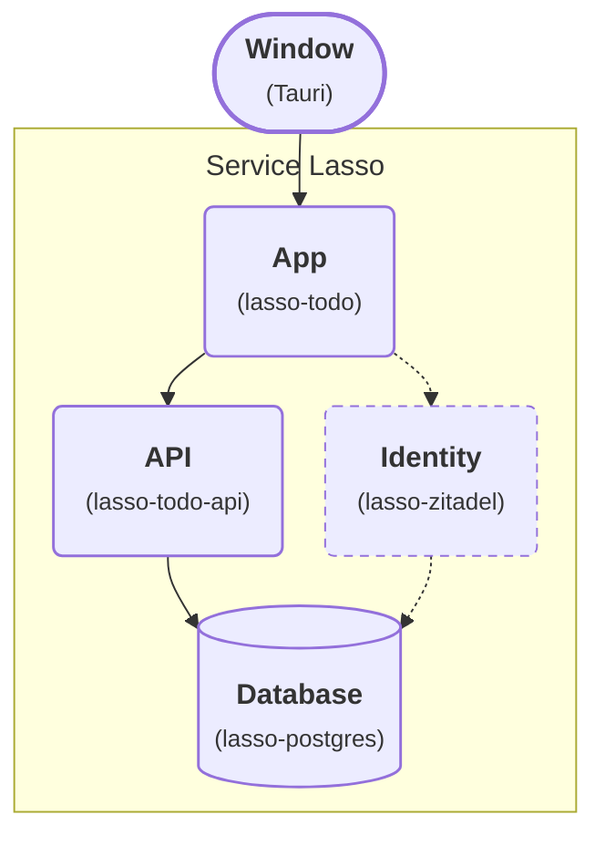

# Advanced — Package Todo as a Tauri Desktop App

Turn your Todo application and its Service Lasso inventory into a Windows
desktop application using the
[Tauri app template](https://github.com/service-lasso/service-lasso-app-tauri).
Todo, the Go API and PostgreSQL keep their existing service responsibilities;
Tauri adds the native window and installation package.

## Outcome

**Stage 5: Add the desktop shell.** Build a Windows installer `.exe`. It installs
the native app, portable Node runtime, Core, Admin assets and service manifests.
Service Lasso acquires the released service executables on first installation.

<div className="tutorial-architecture">



</div>

The highlighted Window is the new addition. Dashed Identity is the optional
SSO layer from the preceding lesson; a fresh installer does not contain your
existing tenant, passwords or keys. The executable path below first proves the
App → API → Database stack. Keep SSO enabled when adopting an existing app, or
configure a new identity workspace explicitly after installation.

| Purpose | Implementation | What it owns |
| --- | --- | --- |
| Desktop | `service-lasso-app-tauri` | Native window, packaged host, startup and close. |
| App | `lasso-todo` | Todo UI and `/todos` proxy. |
| API | `lasso-todo-api` | Go API and database access. |
| Database | `lasso-postgres` | Persistent Todo rows in its workspace service directory. |
| Identity | `lasso-zitadel`, optional | Accounts and SSO; provision separately from application installation. |
| Management | `lasso-serviceadmin` | First-run setup and service lifecycle controls. |
| Secrets | `lasso-secretsbroker` | Protected local operator and service secret custody. |

## Before you begin

- Understand the [Go API lesson](advanced-add-go-todo-api-service.md) and
  [SSO lesson](zitadel-sso-hub.md). Preserve the original tutorial workspace.
- Build on **Windows x64**, with **Node.js 22**, Git, Rust **1.90 or newer**
  using the MSVC toolchain, Visual Studio C++ Build Tools and Windows SDK.
- Install the WebView2 runtime. Follow the
  [official Tauri Windows prerequisites](https://v2.tauri.app/start/prerequisites/).
  The recipient needs WebView2, but does not need Node/npm/Rust to run the
  installed application.
- Keep the build folder separate from all runtime workspaces. Internet is
  needed for the build and first-time service acquisition.

This lesson creates a **fresh desktop workspace**. Do not copy a running
PostgreSQL directory, Broker custody or credentials into the template. Retain
your earlier workspace and use the [backup/restore workflow](../reference/workspace-backup-restore.md)
for any separately verified data migration.

## 1. Create your application from the template

On the template repository, choose **Use this template → Create a new repository**.
Select **Include all branches** so your app receives the native implementation
on `develop`. Then clone **your repository's develop branch**:

```powershell
git clone --branch develop --single-branch https://github.com/YOUR-ACCOUNT/todo-desktop.git
cd todo-desktop
npm ci
```

Use the native build implementation described in the template's
[native wrapper guide](https://github.com/service-lasso/service-lasso-app-tauri/blob/develop/src-tauri/README.md).
The older placeholder Tauri configuration cannot compile an executable. The
checked-in `Cargo.lock` and npm lock bind the build dependencies.

## 2. Add the released Todo stack to your inventory

```powershell
npm run tutorial:todo
```

This adds checksum-verified `services/todo/service.json`,
`services/todo-api/service.json` and `services/postgres/service.json`. Todo uses
API mode; the API depends on PostgreSQL. The helper disables the unrelated
Echo/router/certificate demo services in this **source inventory** and refuses
to overwrite existing Todo service folders.

| Service | Pinned release |
| --- | --- |
| App | `2026.10.4-6f47534` |
| API | `2026.10.4-9b45f09` |
| Database | `2026.10.4-1af7982` |

Review the manifests before committing them to your app repository. Keep
service configuration declarative and secrets in Broker references. The build
copies only seed manifests, not `.state`, database contents, logs or an existing
workspace. The sample database credentials are local tutorial defaults; your
application owns its database policy.

## 3. Give your app its own identity

Edit `src-tauri/tauri.conf.json`:

```json
{
  "productName": "Todo Desktop",
  "version": "0.1.0",
  "identifier": "io.example.todo"
}
```

Change these fields in the existing file; retain its `build`, `app` and `bundle`
sections. Also change the native window's title to `Todo Desktop`.
Choose your own reverse-domain identifier before distributing your app and keep
it stable for upgrades: it determines the user workspace location.

## 4. Compile the Windows installer

```powershell
npm run desktop:build
```

The build prepares a portable Node/Core payload, acquires the checksum-verified
Admin UI and builds Tauri with the locked Cargo dependencies. The output for the
name above is:

```text
src-tauri/target/release/bundle/nsis/Todo Desktop_0.1.0_x64-setup.exe
```

This `.exe` is an **installer containing the app and its resources**. The raw
`src-tauri/target/release/service-lasso-desktop.exe` needs the installed `host/`
payload beside it; copying that binary alone does not transfer the stack.
The payload receipt is `.native/host/native-payload.json`.

If the build reports a missing C++ linker or Windows SDK, complete the Windows
prerequisites and rebuild. A successful Node host or HTML preview cannot replace
native compilation. Code signing is a separate distribution step; see the
[official Windows installer guide](https://v2.tauri.app/distribute/windows-installer/).

## 5. Install and finish first-run setup

Run the installer, then launch **Todo Desktop**. The app starts its bundled
host on available loopback ports and opens its own window. It does not attach
to a separately running Core instance.

1. Choose **Prepare first-run setup** in the desktop shell. This installs and
   configures the pinned Broker service; it does not initialize secrets yet.
2. In Service Admin, choose **Initialize Secrets Broker**. Complete the
   [first-run operator flow](../complete-first-run-setup.md) shown for this
   workspace. Keep recovery material private.
3. Install/configure PostgreSQL, the Go API and Todo through Admin. Start
   PostgreSQL, then the API, then Todo; dependencies include the Node provider.
4. Refresh the desktop service list. The frame opens the running Todo app.
   **Manage services** returns to Admin.
5. Create a Todo, reload it and confirm the same entry remains.

The app-owned paths are now:

| State | Path for `io.example.todo` |
| --- | --- |
| Service inventory and acquired artifacts | `%LOCALAPPDATA%/io.example.todo/services/` |
| Core and protected Broker workspace | `%LOCALAPPDATA%/io.example.todo/runtime/` |
| PostgreSQL cluster | `%LOCALAPPDATA%/io.example.todo/services/postgres/runtime/data/` |
| Private startup/recovery log | `%LOCALAPPDATA%/io.example.todo/host.log` |

The installed program directory contains immutable resources. User state lives
outside it. Restarts preserve edited manifests and database rows; installing a
new version must not replace these with the original seeds. Update an existing
service explicitly through its lifecycle/update workflow.

## 6. Check close, restart and SSO boundaries

Close the desktop window. The native host requests graceful shutdown and waits
for its owned runtime. On a timeout the window remains open with a recovery
message. Inspect the retained `host.log`; shutdown may already have closed the
Admin connection, so that window cannot guarantee recovery controls. Preserve
the workspace and diagnose the failed owned service before attempting recovery.
Do not delete the workspace or kill unrelated processes.

Launch again, start the managed stack if it is not configured to autostart, and
confirm the same Todo IDs remain. Repeat on a second Windows machine before
claiming your own app's distribution acceptance.

For SSO, the native installation must have its own explicit identity/client
configuration. Follow the [SSO tutorial](zitadel-sso-hub.md) against this
workspace, preserving keys and registering its actual Todo callback origin.
Use the Todo URL from Admin in a normal browser for the verified sign-in flow.
Browser SSO proof does not establish embedded WebView SSO, certificate trust or
an OS-native browser callback flow. The fresh desktop seed helper does not
enable identity automatically.

The build above is a **bootstrap-download installer**. Bundling Core and Node
does not prove offline installation of every service, signing, macOS/Linux
native acceptance or GA. The [execution record](../development/documented-examples-verification.md)
separates native compilation, packaged runtime, managed data persistence and
live documentation publication evidence.
