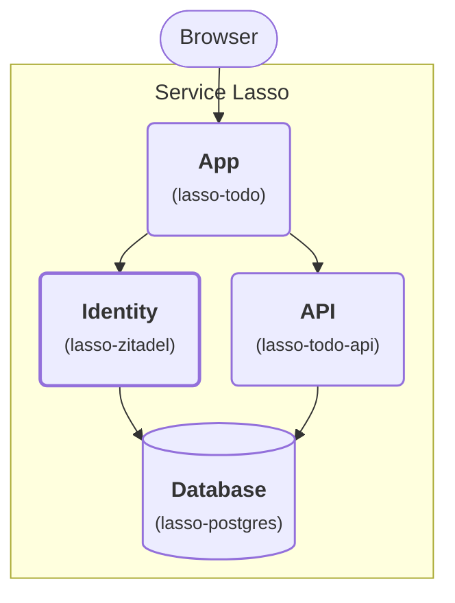

# Advanced — Add Zitadel SSO to the Todo App

Continue the [Go API lesson](advanced-add-go-todo-api-service.md). Keep the App,
API and Database in the same Service Lasso inventory. Add Zitadel as another
managed service, then use it to sign in to **your Todo app**. Service Admin's
operator login and Todo's user login are separate.

## Outcome

**Stage 4: Add identity.** Sign in before reading or adding todos. The API and
database retain the original shared list; this lesson does not split data by user.

<div className="tutorial-architecture">



</div>

Identity is the new highlighted service. During sign-in the browser follows
the App's redirect to Identity and returns to the App's registered callback.

| Purpose | Service | Responsibility / data path |
| --- | --- | --- |
| App | `lasso-todo` (`todo`) | Sign-in callback, server-side session, shared Todo UI and protected `/todos` proxy. |
| API | `lasso-todo-api` (`todo-api`) | Existing private loopback API; reads/writes the original Todo database. |
| Database | `lasso-postgres` (`postgres`) | Retain Todo data plus a separate `zitadel_todo` identity database under `${SERVICE_ROOT}/runtime/data`. |
| Identity | `lasso-zitadel` (`zitadel`) | User accounts, login, signed identity tokens and logout over trusted local HTTPS. |

<details>
<summary>Supporting services</summary>

These also run inside Service Lasso and support the application path above.

| Purpose | Service | Responsibility |
| --- | --- | --- |
| Management | `lasso-serviceadmin` (`@serviceadmin`) | Install/configure services, inspect endpoints and control lifecycle. |
| Secrets | `lasso-secretsbroker` (`@secretsbroker`) | Supply the stable identity master key and bootstrap password at launch. |
| Certificates | `lasso-localcert` (`@todo-certs`) | Generate the private local CA and server certificate under its `data/` directory. |
| Runtime | `lasso-node` (`@node`) | Run the App and Database launcher. |
| Example | `echo-service` | Existing baseline starter service. |

</details>

## Before you begin

- Finish the first three lessons and retain their inventory, workspace and data.
  Commands run from your Core checkout and use `workspace/canonical-services-root`
  and `workspace/demo-instance`.
- Use the current `develop` checkout containing `examples/todo-sso/`. Preserve
  local source changes before updating, then run `npm ci` and `npm run build`.
  The provisioning helper loads this checkout's compiled Broker modules.
- Use PostgreSQL `2026.10.4-1af7982` from the [database lesson](intermediate-make-todo-app-durable.md).
  Upgrade an older adapter-backed install using its retained-data instructions first.
- Back up manifests and databases. Stop Todo, the API and PostgreSQL through
  Admin before changing manifests.
- Identity requests local port `18084`. Check the **allocated** endpoint before
  registering the issuer; a requested port is not an allocation guarantee.

This is a local Windows learning flow. Linux/macOS native identity consumption
and production deployment are separate qualification work.

## 1. Add the identity and certificate services

Import complete release manifests:

```powershell
node dist/cli.js services import service-lasso/lasso-localcert --tag 2026.9.25-588398b --services-root workspace/todo-sso-imports --workspace-root workspace/demo-instance
node dist/cli.js services import service-lasso/lasso-zitadel --tag 2026.9.25-93d4c84 --services-root workspace/canonical-services-root --workspace-root workspace/demo-instance
node examples/todo-sso/configure-identity.mjs workspace/canonical-services-root workspace/todo-sso-imports
```

The helper pins the imports, enables Identity, requests a separate database and
trusted HTTPS, and declares Broker secret references. It changes manifests only,
preserving PostgreSQL's data path and existing database requests. Use it for a
**new** identity instance, never to reset an initialized tenant or repair an
unknown database.

Certificates are imported into a staging inventory and copied as `@todo-certs`.
Your baseline `@localcert`, its domains, CA and certificates stay intact. The
new service exports dedicated Todo certificate names, avoiding a global-path
collision with baseline routing.

The certificate package's sample generates client certificates. The helper
switches to server certificates for `localhost` and `127.0.0.1`, removes the
unused Java trust-store dependency, and leaves trust installation manual. It
also replaces Identity's disabled TLS launch mode and uses one importer-compatible
healthcheck. This is an example of adapting released services for an app-owned inventory.

Refresh Admin. Install/configure Certificates and Identity, and refresh
PostgreSQL's configuration. Keep the App and API stopped for now.

## 2. Generate and trust the local certificate

In Certificates' setup view run **generate-pfx**, then **generate-key-cert**.
Preserve the CA, key and certificate under
`workspace/canonical-services-root/@todo-certs/data/`. Do not commit them or run
the unrelated renewal step.

Inspect the CA fingerprint and deliberately trust `rootCA.pem` in your own
**Current User** browser/OS trust store. This is a local operator decision; the
helper does not install trust. Never bypass a certificate warning.

Stop the owned Core/demo process after stopping its services. In the terminal
that starts your tutorial runtime:

```powershell
$env:NODE_EXTRA_CA_CERTS = (Resolve-Path workspace/canonical-services-root/@todo-certs/data/rootCA.pem).Path
npm run demo
```

Keep the same inventory and workspace. The managed App inherits this CA so its
OIDC requests verify Identity's HTTPS certificate. Preserve the instance and
Broker custody; restarting is not re-onboarding. Whole-demo shutdown/recycle
remains tracked separately in [#1665](https://github.com/service-lasso/service-lasso/issues/1665);
check actual owned listeners before restarting.

## 3. Provision identity secrets before first start

Keep the actual Broker started and ready after first-run setup. In PowerShell 7,
run the local operator helper; it prompts privately for the initial password:

```powershell
pwsh -NoProfile -File examples/todo-sso/provision-identity.ps1 -ServicesRoot workspace/canonical-services-root -WorkspaceRoot workspace/demo-instance -ApiOrigin http://127.0.0.1:17883
```

`17883` is the default demo Core API port, not Admin's `17700`; use your actual
Core endpoint if changed. The helper loads that workspace's protected Broker
context, uses the declared signed create-only IPC grants and prints metadata
only. It generates the master key in memory and preserves existing references
on rerun. Save the prompted password in your private password manager. Use
12–69 characters including upper/lowercase, a number and a symbol.

It creates these references in namespace `services/zitadel`:

| Reference | Required value |
| --- | --- |
| `identity.ZITADEL_MASTERKEY` | 24 random bytes encoded as **exactly 32 printable ASCII characters**, retained for the identity database's lifetime. |
| `identity.ZITADEL_BOOTSTRAP_PASSWORD` | A strong private initial administrator password meeting Zitadel's password policy. |

Do not put values in a manifest, shell history, issue, screenshot or log. The
Broker's generic 32-random-byte generator encodes to 43 base64url characters;
that result is **not** a 32-byte Zitadel master key. Do not replace the stable
master key after initialization. See [key custody](../reference/vault-key-bootstrap.md)
and [secret access assignments](../components/service-admin/security-secret-access-assignments.md).

The helper uses `ZITADEL_FIRSTINSTANCE_ORG_HUMAN_*` for the initial administrator.
For its **Todo Tutorial** organization the tested login name is
`todo-admin@todo-tutorial.localhost`; `todo-admin@localhost.test` is the contact
email, not that login name. These settings apply only to a new instance. Sign
in with the private bootstrap password, then manage users in Identity; changing
these settings does not reset an existing administrator.

## 4. Start Identity and register Todo

Start PostgreSQL, then Identity through Admin. Confirm both are healthy and
identity uses `zitadel_todo`, separate from the Todo tables. Open the allocated
Identity console, normally `https://localhost:18084/ui/console/`, without a
certificate warning.

Check `https://localhost:18084/.well-known/openid-configuration`: its `issuer`
must match the actual HTTPS origin exactly. Identity is not the Core/Admin URL.

Sign in as the initial administrator. Create a local **Todo Tutorial** project
and application **Todo**:

1. Choose **Web**, Authorization Code, authentication method **None / PKCE**.
   This is a public client; no client secret belongs in the browser or manifest.
2. Read Todo's allocated port in Admin. For `18552`, register exactly
   `http://127.0.0.1:18552/auth/callback` and post-logout `http://127.0.0.1:18552/`.
3. Enable development mode for this local HTTP registration. Use `127.0.0.1`
   consistently; `localhost` is a different callback origin.
4. Save the client ID and create a verified local test user with a private
   password. Use the **login name shown in that user's details**, which may
   include an organization suffix, rather than assuming its email is a login
   name. Use that user for the app rather than the identity administrator.

This follows [Zitadel's code + PKCE flow](https://zitadel.com/docs/guides/integrate/login/oidc/login-users).

## 5. Upgrade and configure the managed Todo consumer

The earlier pinned Todo release has no sign-in implementation. With Todo
stopped, update **only** its manifest version/artifact tag to `2026.10.4-6f47534`,
retain environment, dependencies, endpoints and data, then refresh Admin and
install the new archive. Provider-backed launch and checksums remain the same.

The acquired archive includes `configure-sso.mjs` at its root. Read that actual
directory from the install receipt; do not start a second app process.
Replace the client ID with the public ID you just registered:

```powershell
$todoArtifact = (Get-Content workspace/canonical-services-root/todo/.state/install.json -Raw | ConvertFrom-Json).artifact.extractedPath
node "$todoArtifact/configure-sso.mjs" workspace/canonical-services-root/todo enable https://localhost:18084 '<Todo client ID>'
```

The helper adds `zitadel` to the existing dependencies and these non-secret
settings, preserving API mode and data:

```json
{
  "TODO_OIDC_ISSUER": "https://localhost:18084",
  "TODO_OIDC_CLIENT_ID": "<Todo client ID>",
  "TODO_ORIGIN": "http://127.0.0.1:${endpoint.web.port}"
}
```

Refresh discovery. Start the API, then Todo through Admin. Failed discovery,
untrusted HTTPS or incomplete configuration must stop startup; there is no
anonymous fallback.

Todo handles code + S256 PKCE server-side, verifies state/nonce and signed
ID-token claims, and retains a bounded opaque session. Browser JavaScript gets
the display name and session CSRF token, not identity/access tokens. Its cookie
is HttpOnly/SameSite for this explicitly local HTTP origin. Remote deployment
needs HTTPS, Secure cookies and API authorization; do not expose the private
Go API or Database as a way around app login.

## 6. Prove sign-in works in Todo

1. In a fresh browser session, open Todo. It shows **Sign in with Zitadel**;
   `/todos` returns 401 before login.
2. Sign in as the test user. The browser reaches Identity's login and returns
   to the exact callback. Todo shows the signed-in name.
3. Confirm the original todos remain, add a todo, then refresh and confirm the
   same IDs/data remain in the original database.
4. Sign out. The local session is cleared before Identity logout. Todo returns
   to signed-out state; the old cookie no longer authorizes `/todos`.
5. Cancel a login or try an unsolicited/tampered callback. Todo shows sign-in
   failure without creating an authenticated session.
6. Stop/start Todo through Admin and sign in again. Sessions are deliberately
   lost on restart while rows/IDs remain. An identity outage must not admit a
   new anonymous session.

**Pass:** managed Identity and Todo complete actual browser login, protected
reads/writes, logout and data-preserving restart. Identity health, protocol
fixtures and documentation builds alone do not prove this.

## Disable sign-in without deleting data

Stop Todo, run the acquired helper with `disable`, refresh discovery and start:

```powershell
node "$todoArtifact/configure-sso.mjs" workspace/canonical-services-root/todo disable
```

This intentionally restores the anonymous local lesson. Preserve Identity's
database/master key, Broker custody and certificates if you stop its services.
See the [execution record](../development/documented-examples-verification.md)
and [consumer contracts](../reference/zitadel-consumer-integration.md).

Next: [Package Todo as a Tauri desktop app](package-todo-tauri.md), keeping its
managed App, API and Database inside Service Lasso.
