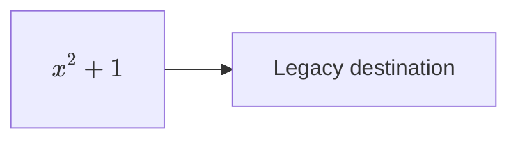

import 'katex/dist/katex.css';
import './consumer.css';

```mermaid
---
config:
  forceLegacyMathML: true
---
flowchart LR
  A["$$x^2 + 1$$"] --> B["Legacy destination"]
```

CSS consumerSecond child

