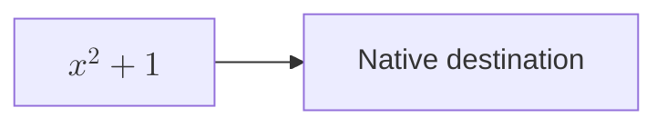
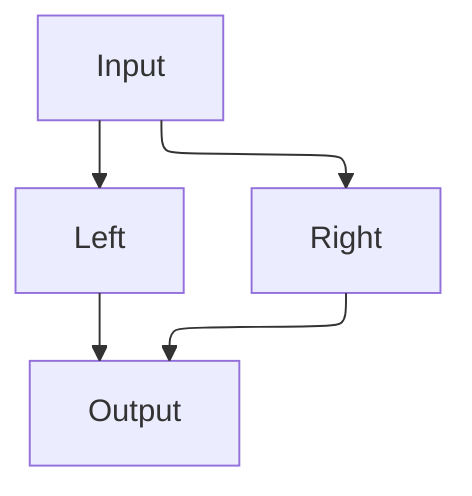

```mermaid
flowchart LR
  A["$$x^2 + 1$$"] --> B["Native destination"]
```

```mermaid
---
config:
  layout: elk
---
flowchart TD
  Input --> Left
  Input --> Right
  Left --> Output
  Right --> Output
```
